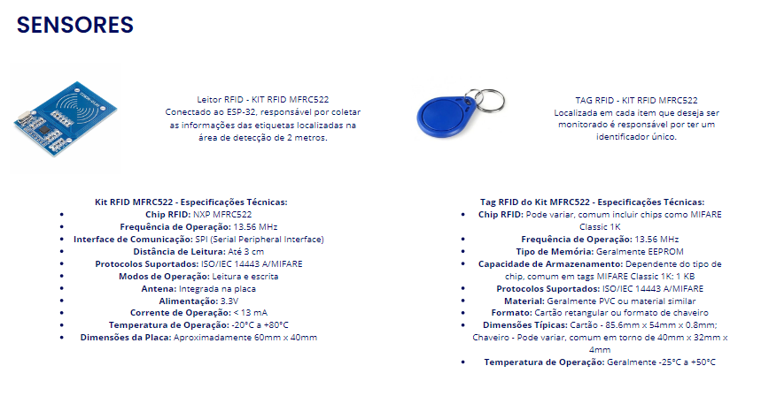
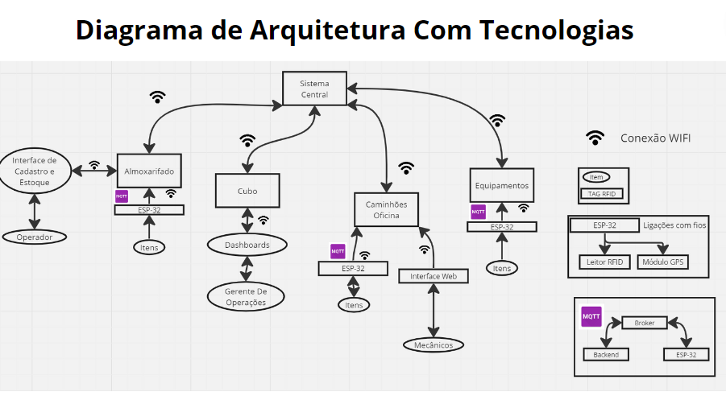
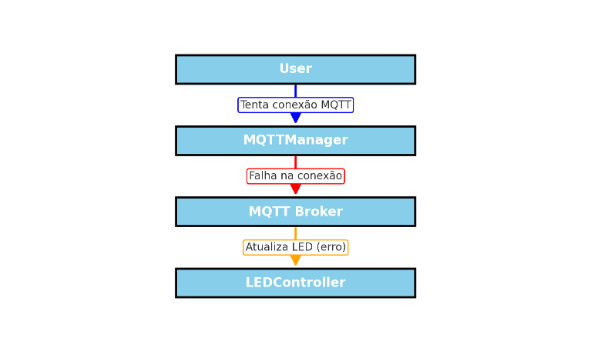

# Documentação IOTvos - Módulo 4 - Inteli

## Nome do Grupo

#### Nomes dos integrantes do grupo

## Sumário

[1. Introdução](#c1)

[2. Metodologia](#c2)

[3. Desenvolvimento e Resultados](#c3)

[4. Possibilidades de Descarte](#c4)

[5. Conclusões e Recomendações](#c5)

[6. Referências](#c6)

 

# 1. Introdução (sprint 1)

&nbsp;&nbsp;&nbsp;&nbsp;A Atvos é uma proeminente empresa energética que surgiu em 2007 com uma visão audaciosa: revolucionar o setor energético por meio da produção de energia limpa e sustentável. Hoje, a Atvos é reconhecida como a segunda maior produtora e comerciante de etanol e energia elétrica provenientes da cana-de-açúcar no país.[1]

&nbsp;&nbsp;&nbsp;&nbsp;O compromisso da Atvos com a sustentabilidade é um dos pilares fundamentais de sua missão, o que a posicionou como uma das principais forças impulsionadoras na emissão de Créditos de Descarbonização (CBIOs) no Brasil. Em meio a um cenário global de crescente preocupação com as mudanças climáticas e a busca por alternativas de energia mais limpa, a Atvos destaca-se como um líder visionário na transição para um futuro mais sustentável e ecologicamente responsável.

&nbsp;&nbsp;&nbsp;&nbsp;No entanto, a empresa tem enfrentado desafios significativos em relação ao rastreamento e localização de equipamentos, peças e insumos. Essa dificuldade resulta em um controle de estoque ineficiente, o que, por sua vez, cria condições favoráveis para situações indesejadas, como desvios ou roubos.

## 1.1 Objetivos

&nbsp;&nbsp;&nbsp;&nbsp;Como objetivo geral é imperativo estabelecer um sistema de monitoramento inovador, aproveitando as técnicas de Internet das Coisas (IoT), para rastrear e fornecer informações precisas sobre a localização de equipamentos e outros ativos do cliente. A principal missão desse sistema é permitir um monitoramento detalhado de cada recurso, com o propósito de reduzir consideravelmente ocorrências indesejadas, como desvios e roubos, e, simultaneamente, elevar a eficiência operacional otimizando processos.

&nbsp;&nbsp;&nbsp;&nbsp;A implantação da IoT possibilitará o acúmulo de dados valiosos, permitindo a criação de um histórico robusto e confiável. Esse histórico será essencial para embasar tomadas de decisão futuras, orientando estratégias e aprimorando a eficácia das operações da empresa, visando um futuro mais seguro e eficiente.

&nbsp;&nbsp;&nbsp;&nbsp;Ademais, são considerados como objetivos específicos:

1. Desenvolver uma solução para monitoramento da localização de materiais e recursos que se encontram na industria da Atvos.
     
2. Criar um método dentro do almoxarifado de escaneamento dos equipamentos/peças importantes na entrada e/ou saída dos mesmos.  
   
3. Revisar o processo de logística reserva de peças da Atvos e orientar os operadores a retornar o equipamento “trocado” ao almoxarifado para controle e devido descarte.
   
4. Retirar o processo da registro manual dentro dos almoxarifados da Atvos.  

5. Possibilitar abertura e fechamento de Ordens de Serviço digitalmente idealmente. No mínimo, exportar dados para arquivos CSV e/ou TXT para facilitar a integração com outros sistemas.

## 1.2 Proposta da solução

&nbsp;&nbsp;&nbsp;&nbsp;A proposta de solução apresentada visa abordar os desafios atuais enfrentados pela Atvos, incluindo problemas de roubo, perda de peças em estoque sob rodas e deficiências no monitoramento das operações de reparo. Esta solução proporcionará:

1. Monitoramento em Tempo Real: Por meio da integração de dispositivos IoT em equipamentos, peças e insumos, permitirá à Atvos o monitoramento em tempo real da localização e do estado de seus ativos críticos, reduzindo a incidência de roubos e perdas.

2. Alertas e Notificações: O sistema gerará alertas imediatos em caso de movimentação não autorizada de equipamentos ou peças, possibilitando ação imediata para evitar prejuízos.

3. Eficiência na Manutenção: Facilitará o agendamento e o acompanhamento de manutenções preventivas, assegurando a disponibilidade contínua dos equipamentos e prevenindo paralisações não programadas.

4. Rastreamento de Histórico: Com a capacidade de registrar e armazenar o histórico de localização e manutenção, fornecerá à Atvos informações valiosas para análises e tomadas de decisão futuras.

5. Gerenciamento de Estoque: A solução oferecerá gerenciamento de estoque automatizado, rastreando todas as peças em tempo real e notificando quando a reposição for necessária.

6. Eficiência Operacional: Reduzindo perdas, aprimorando a gestão de ativos e otimizando a manutenção, esta solução tem o objetivo de elevar a eficiência operacional da Atvos, reduzindo custos e aprimorando a produtividade.

&nbsp;&nbsp;&nbsp;&nbsp;O funcionamento da solução proposta é baseado na integração de dispositivos IoT (Internet das Coisas) em equipamentos e peças, juntamente com uma plataforma web avançada. Os dispositivos IoT, incluindo ESP32, módulos GPS e leitores de RFID, são implantados nos ativos da empresa. Eles coletam dados em tempo real, como localização e status das peças. A transmissão desses dados para o servidor de backend é realizada recorrentemente, permitindo o monitoramento contínuo. O servidor de backend, acessível por meio de uma interface web amigável, fornece informações detalhadas sobre ativos, alertas instantâneos em caso de eventos não autorizados e um histórico completo de movimentos. A solução também incorpora um sistema de gerenciamento de estoque automatizado, rastreando a entrada e saída de peças em estoque.

&nbsp;&nbsp;&nbsp;&nbsp;A solução proposta de IoT é adaptada às necessidades específicas da Atvos e visa transformar a gestão de ativos da empresa, tornando-a mais eficaz, segura e eficiente, superando os problemas atuais de roubos, perdas e falta de monitoramento no processo de reparo.

## 1.3 Justificativa

&nbsp;&nbsp;&nbsp;&nbsp;A proposta de solução apresentada oferece uma abordagem abrangente e eficaz para os desafios enfrentados pela Atvos, destacando diversos pontos fortes que a tornam uma escolha diferencial, vantajosa para a empresa, e o potencial da solução a longo prazo:

1. Custo-Efetividade:

&nbsp;&nbsp;&nbsp;&nbsp;A solução de IoT proposta oferece uma abordagem de custo-efetividade notável. Ao reduzir roubos, perdas e paralisações não programadas, a empresa economiza substancialmente em despesas de reposição, reparos de emergência e interrupções operacionais.

2. Eficiência Operacional Aprimorada:

&nbsp;&nbsp;&nbsp;&nbsp;A capacidade de monitorar em tempo real a localização e o status dos ativos, bem como monitorar e programar manutenções, resulta em uma eficiência operacional significativamente melhorada. Isso significa menos tempo de inatividade, maior produtividade e redução de custos operacionais.

3. Solução Abrangente para Diferentes Equipamentos e Insumos:

&nbsp;&nbsp;&nbsp;&nbsp;Uma das principais forças desta solução é sua versatilidade. Ela é adaptável para monitorar uma variedade de equipamentos e insumos, garantindo que a Atvos possa aplicar a mesma abordagem eficaz a uma ampla gama de ativos, desde tratores até peças de estoque sob rodas.

4. Ambiente Web Diferenciado e Fácil de Usar:

&nbsp;&nbsp;&nbsp;&nbsp;O sistema web que suporta esta solução é projetado para ser intuitivo e de fácil uso. Sua interface de usuário amigável torna o gerenciamento de ativos e a tomada de decisões baseadas em dados uma tarefa simples e acessível a todos os níveis de operadores e gerentes.

5. Histórico e Análises Sólidos:

&nbsp;&nbsp;&nbsp;&nbsp;A capacidade de rastrear o histórico de localização e manutenção oferece à Atvos informações valiosas para análises e tomadas de decisão. Isso permite uma abordagem proativa para o gerenciamento de ativos, identificando tendências e oportunidades de otimização.

6. Prevenção de Roubos e Perdas:

&nbsp;&nbsp;&nbsp;&nbsp;Ao monitorar ativos e peças em tempo real e gerar alertas instantâneos em caso de movimentação não autorizada, esta solução fornece uma camada de segurança crítica para prevenir roubos e perdas, o que impacta diretamente a economia da empresa.

7. Redução de Custos a Longo Prazo:

&nbsp;&nbsp;&nbsp;&nbsp;A combinação de eficiência operacional aprimorada, prevenção de perdas e gestão de estoque eficiente contribui para uma redução de custos significativa a longo prazo. Os benefícios superam os investimentos iniciais.
Em resumo, a proposta de solução não apenas aborda os desafios críticos da Atvos, mas também fornece uma vantagem competitiva ao oferecer uma solução abrangente e econômica.

&nbsp;&nbsp;&nbsp;&nbsp;A solução se destaca pelo seu potencial de versatilidade, facilidade de uso, foco na prevenção de perdas e eficiência operacional, bem como a capacidade de apoiar uma ampla gama de ativos. É uma resposta sólida às necessidades da Atvos, posicionando a empresa para alcançar maior controle e sucesso em seu ambiente operacional.

# 2. Metodologia (sprint 3)

### **Metodologia RM-ODP**

&nbsp;&nbsp;&nbsp;&nbsp;A metodologia RM-ODP (Reference Model of Open Distributed Processing) é um modelo de referência em ciência da computação, que fornece um framework para a padronização de sistemas de processamento distribuído aberto (ODP). Ela suporta distribuição, interconexão, independência de plataforma e tecnologia, e portabilidade, juntamente com um framework de arquitetura empresarial para a especificação de sistemas ODP.

&nbsp;&nbsp;&nbsp;&nbsp;A metodologia RM-ODP é baseada em conceitos precisos derivados de desenvolvimentos atuais de processamento distribuído e, sempre que possível, no uso de técnicas formais de descrição para especificação da arquitetura. Ela tem quatro elementos fundamentais: uma abordagem de modelagem orientada a objetos para especificação de sistemas; a especificação de um sistema em termos de visões separadas mas inter-relacionadas; a definição de uma infraestrutura de sistema que provê transparências de distribuição para as aplicações do sistema; e um framework para avaliar a conformidade do sistema1

&nbsp;&nbsp;&nbsp;&nbsp;A metodologia RM-ODP organiza os interesses dos stakeholders através de pontos de vista apropriados. Cada ponto de vista tem um conjunto de conceitos, estruturas e regras, e possui uma linguagem adequada para especificar o sistema dentro do ponto de vista. Os pontos de vista limitam a complexidade percebida pelos stakeholders. A tarefa do stakeholder fica mais simples, podendo ponderar com foco os pilares principais para sua análise sem complexidade desnecessária.

1. **Negócios:**
    - Nesta abordagem, o pilar de negócios se concentra na identificação e compreensão dos objetivos e impactos comerciais do sistema IoT. Isso inclui a definição de casos de uso, identificação de stakeholders, modelos de monetização, e o impacto nos processos e estratégias de negócios.
2. **Requisitos Funcionais:**
    - Aqui, o foco está nos requisitos operacionais ou seja nas descrições detalhadas das funções e comportamentos que um sistema, software ou produto deve realizar no sistema IoT, como as funcionalidades específicas que o sistema deve ter. Isso inclui capacidades de coleta de dados, processamento, interação com dispositivos e usuários, e análise dos dados coletados.
3. **Requisitos Não Funcionais:**
    - Este pilar considera os requisitos de desempenho, segurança, confiabilidade, escalabilidade e outros aspectos que não são funcionalidades diretas do sistema IoT, mas são cruciais para sua eficácia e confiabilidade.
    - Além disso este pilar está diretamente relácionado a ISO/IEC 25010, que é um padrão ISO para qualidade de software que veio para substituir a ISO/IEC 9126. Com o objetivo de representar o conjunto definido de características, categorias de atributos de qualidade de software, e relações entre elas. Essa arquitetura fornece a estrutura para especificar os requisitos de qualidade e avaliá-los.
4. **Arquitetura:**
    - A arquitetura neste contexto IoT foca na estrutura do sistema, incluindo a distribuição dos dispositivos, a comunicação entre eles, protocolos de comunicação, interfaces e design de rede. Além disso, considera a integração e escalabilidade do sistema.
5. **Tecnologia:**
    - Este pilar aborda as escolhas tecnológicas para a implementação do sistema IoT, como a seleção de sensores, plataformas de hardware, linguagens de programação, protocolos de comunicação e ferramentas de desenvolvimento.

### Benefícios da utilização do **RM-ODP Adaptado para Projetos IoT**

- **Visão Holística:** A metodologia adaptada permite uma compreensão abrangente dos aspectos de negócios, requisitos e tecnologias envolvidas no sistema IoT, facilitando a identificação de interdependências e garantindo uma abordagem integrada.
- **Estruturação Clara:** A estrutura dos pilares adaptados oferece uma maneira organizada de documentar e gerenciar diferentes aspectos do projeto, ajudando na comunicação entre as equipes e na gestão de requisitos multifacetados.
- **Adaptação Flexível:** Ao adaptar os pilares, você pode ajustar a metodologia para se adequar às necessidades específicas do projeto IoT, garantindo que os aspectos mais relevantes sejam abordados de forma apropriada.

Utilizar o RM-ODP adaptado em um projeto IoT oferece uma estrutura sólida para lidar com a complexidade e os múltiplos aspectos envolvidos nesse tipo de sistema, permitindo uma abordagem mais abrangente e estruturada.

# 3. Desenvolvimento e Resultados 

## 3.1. Domínio de Fundamentos de Negócio

&nbsp;&nbsp;&nbsp;&nbsp;Nesta seção do documento, serão abordados os conceitos de negócios e mercado em relação à Atvos. O enfoque recai tanto sobre o setor em que a empresa atua quanto sobre a própria Atvos, com uma análise abrangente do mercado setorial, considerando as 5 Forças de Porter que influenciam a competitividade, a matriz SWOT para identificar pontos fortes, fraquezas, oportunidades e ameaças, a apresentação do problema a ser abordado e como os dados relacionados a ele serão tratados. Ademais, será discutida a proposta de valor da solução e fornecido um detalhamento do "Bill of Materials" (BOM), destacando os componentes e recursos essenciais para o seu funcionamento.

### 3.1.1. Contexto da Indústria (sprint 1)

#### 3.1.1.1 Setor de Atuação da Atvos

&nbsp;&nbsp;&nbsp;&nbsp;O setor de atuação da Atvos abrange a produção e comercialização de etanol, açúcar VHP e energia elétrica a partir da cana-de-açúcar e sua biomassa. Para uma análise abrangente do mercado em que a Atvos opera, é necessário considerar não apenas a empresa em si, mas também o contexto mais amplo do setor sucroenergético.

&nbsp;&nbsp;&nbsp;&nbsp;O setor sucroenergético é uma parte crucial da indústria de agronegócios. Ele abrange a produção de matérias-primas a partir da cana-de-açúcar, que é uma cultura versátil e altamente eficiente em termos de energia. A cana-de-açúcar é cultivada em vastas plantações e, uma vez colhida, passa por uma série de processos industriais para extrair seus componentes-chave: sacarose para a produção de açúcar, matéria-prima para a produção de etanol e biomassa para geração de energia elétrica. Esse setor desempenha um papel importante na economia de vários países, incluindo o Brasil, onde a produção de cana-de-açúcar é uma atividade agrícola de grande escala.

&nbsp;&nbsp;&nbsp;&nbsp;O modelo de negócio nesse setor envolve a gestão completa da cadeia de produção, desde o cultivo da cana até a comercialização dos produtos finais. Isso inclui o plantio, a colheita mecanizada, o processamento industrial, a destilação para a produção de etanol, a produção de açúcar, a cogeração de energia elétrica a partir da biomassa residual e, por fim, a distribuição dos produtos para o mercado interno e, em alguns casos, para exportação. O setor sucroenergético é caracterizado por ser intensivo em capital, envolvendo investimentos substanciais em infraestrutura de plantações, usinas de processamento e instalações de geração de energia. Além disso, a sustentabilidade e a eficiência operacional são aspectos cruciais do modelo de negócio, uma vez que a produção responsável de matérias-primas, a minimização de resíduos e a otimização da produção de energia são essenciais para o sucesso a longo prazo das empresas nesse setor.

#### 3.1.1.2 Cenário Nacional

&nbsp;&nbsp;&nbsp;&nbsp;O Brasil desempenha um papel de destaque na produção global de cana-de-açúcar, o que coloca a Atvos em uma posição estratégica. A produção de etanol a partir da cana-de-açúcar é uma alternativa significativa aos combustíveis fósseis, contribuindo para a redução das emissões de gases de efeito estufa e para a diversificação da matriz energética do país.

&nbsp;&nbsp;&nbsp;&nbsp;Além disso, o setor sucroenergético é um importante pilar da economia brasileira, gerando empregos e renda em regiões onde a presença da Atvos é significativa. A produção de açúcar e energia elétrica também é vital para atender às necessidades nacionais e, em alguns casos, permitir a exportação desses produtos.

#### 3.1.1.3 Cenário Internacional

&nbsp;&nbsp;&nbsp;&nbsp;O mercado de biocombustíveis, no qual o etanol tem um papel relevante, tem experimentado um crescimento global. A busca por fontes de energia mais limpas e renováveis tem impulsionado a demanda por etanol e outros biocombustíveis em todo o mundo. Isso pode representar oportunidades de expansão para empresas como a Atvos, que estão posicionadas para atender a essa demanda crescente.

&nbsp;&nbsp;&nbsp;&nbsp;Além disso, o açúcar VHP é um produto essencial na indústria de alimentos e bebidas, com demanda internacional constante. A Atvos, como produtora desse insumo, também se beneficia desse mercado global.

&nbsp;&nbsp;&nbsp;&nbsp;Quando se trata de energia elétrica, a produção a partir de fontes renováveis, como a biomassa de cana-de-açúcar, está alinhada com os esforços globais para mitigar as mudanças climáticas. A comercialização de energia elétrica no mercado internacional pode ser uma oportunidade de expansão estratégica para empresas do setor sucroenergético.

#### 3.1.1.4 Principais Concorrentes

##### 3.1.1.4.1 BP Bunge Bioenergia - Alta Concorrência

&nbsp;&nbsp;&nbsp;&nbsp;A BP Bunge é uma empresa que atua em um setor similar ao da Atvos, tornando-se um concorrente direto no mercado de biocombustíveis e produtos relacionados à cana-de-açúcar. A BP Bunge é uma joint venture entre a gigante de energia BP e a empresa de agronegócios Bunge. Essa parceria estratégica combina a experiência da BP em energia e combustíveis com a expertise da Bunge na produção de alimentos e commodities agrícolas.

&nbsp;&nbsp;&nbsp;&nbsp;A BP Bunge concentra suas atividades na produção de etanol e açúcar a partir da cana-de-açúcar, bem como na geração de energia elétrica a partir da biomassa, semelhante às operações da Atvos. Isso a coloca em concorrência direta com a Atvos no mercado brasileiro de biocombustíveis e produtos relacionados à cana-de-açúcar. Ambas as empresas competem pela produção eficiente e sustentável desses produtos, bem como pela participação em programas de créditos de carbono e pela conquista de mercados internacionais, onde os biocombustíveis e o açúcar têm demanda crescente.

&nbsp;&nbsp;&nbsp;&nbsp;A concorrência entre a Atvos e a BP Bunge impulsiona a inovação e o avanço na produção de biocombustíveis e açúcar, beneficiando não apenas as empresas, mas também o setor como um todo. A busca pela sustentabilidade e eficiência nas operações é uma característica compartilhada por ambas as empresas, uma vez que estão sujeitas a regulamentações ambientais rigorosas e à crescente demanda dos consumidores por produtos responsáveis do ponto de vista ambiental. Portanto, a presença da BP Bunge no mercado mantém a Atvos em constante evolução, impulsionando melhorias contínuas na produção de energia limpa e na utilização responsável dos recursos naturais.

##### 3.1.1.4.2 Raízen - Alta Concorrência

&nbsp;&nbsp;&nbsp;&nbsp;A Raízen é outra concorrente significativa da Atvos no mercado de biocombustíveis, açúcar e energia a partir da cana-de-açúcar. A Raízen é uma joint venture entre a Shell e o Grupo Cosan, o que combina a expertise de uma grande empresa de energia e uma empresa líder no setor sucroenergético. Essa parceria estratégica coloca a Raízen em uma posição forte para competir no mercado global de biocombustíveis e produtos relacionados à cana-de-açúcar.

&nbsp;&nbsp;&nbsp;&nbsp;Assim como a Atvos, a Raízen se concentra na produção de etanol, açúcar e energia elétrica a partir da cana-de-açúcar e sua biomassa. Essa similaridade de atuação a torna um concorrente direto no Brasil e em mercados internacionais. Ambas as empresas buscam a eficiência na produção, a sustentabilidade e a responsabilidade ambiental em suas operações, o que é essencial em um setor que lida com matérias-primas de origem agrícola.

##### 3.1.1.4.3 São Martinho - Média Concorrência

&nbsp;&nbsp;&nbsp;&nbsp;A São Martinho é outra concorrente de destaque no setor sucroenergético e, portanto, é uma empresa que rivaliza com a Atvos em diversas áreas de atuação. A São Martinho é uma das maiores empresas do setor de cana-de-açúcar no Brasil e tem uma longa história de atuação, o que a coloca como uma concorrente sólida no mercado.

&nbsp;&nbsp;&nbsp;&nbsp;A principal área de atuação da São Martinho é a produção de açúcar e etanol a partir da cana-de-açúcar, que é semelhante ao foco da Atvos. A empresa opera diversas usinas e tem uma capacidade significativa de produção, o que a torna uma concorrente direta no mercado de açúcar e etanol no Brasil. A São Martinho também tem uma presença importante na geração de energia a partir da biomassa, contribuindo para o fornecimento de energia limpa ao mercado.

&nbsp;&nbsp;&nbsp;&nbsp;Como concorrente da Atvos, a São Martinho compete não apenas pela produção eficiente de açúcar e etanol, mas também pela busca de práticas sustentáveis em suas operações. Ambas as empresas enfrentam desafios semelhantes, como as flutuações nos preços das commodities e a necessidade de atender a rigorosas regulamentações ambientais. A concorrência entre elas impulsiona a inovação e o aprimoramento na produção de biocombustíveis e açúcar, resultando em produtos de melhor qualidade e mais eficiência operacional.

#### 3.1.1.5 5 Forças de Porter

&nbsp;&nbsp;&nbsp;&nbsp;As 5 Forças de Porter são um modelo de análise competitiva desenvolvido por Michael Porter. Elas ajudam a avaliar o ambiente competitivo de uma indústria, identificando fatores que podem afetar a competitividade das empresas. As cinco forças incluem o poder de barganha dos fornecedores, o poder de barganha dos compradores, a ameaça de produtos substitutos, a ameaça de novos entrantes e a rivalidade entre os concorrentes. Ao examinar cada uma dessas forças, é possível compreender melhor o posicionamento e as estratégias das empresas em um mercado específico.

Figura 01 - 5 forças de Porter Atvos

Fonte: Material produzido pelos autores (2023)

| Forças                              | Quem são                               | Ameaças                                      | Reações Possíveis                                                                                                                                                           |
|-------------------------------------|----------------------------------------|----------------------------------------------|---------------------------------------------------------------------------------------------------------------------------------------------------------------------------|
| Concorrentes Atuais (F1)             | BP Bunge, Raízen, São Martinho         | Competição por recursos, preços, margens de lucro, fusões e aquisições, sustentabilidade | Inovação constante, eficiência operacional, adaptação a mudanças no mercado, práticas comerciais sustentáveis e responsáveis.                                                |
| Concorrentes Potenciais (F2)         | Novas empresas no setor sucroenergético | Pressão de Preços de Novos Concorrentes, Inovações Tecnológicas de Novos Entrantes Riscos Financeiros | Inovação constante, parcerias estratégicas, monitoramento de avanços tecnológicos, adaptação à mudanças no cenário competitivo.                                           |
| Produtos Substitutos (F3)           | Biocombustíveis de segunda geração, Açúcar alternativo, Energia renovável | Inovações que oferecem alternativas aos produtos da Atvos, fazendo assim com que ela perca espaço de mercado. Perder clientes devido às pressões de adaptações | Pesquisa e desenvolvimento de novas tecnologias, ênfase na sustentabilidade, busca por aplicações alternativas para os produtos, diferenciação pela produção responsável. |
| Fornecedores (F4)                   | Syngenta, Bayer, Grunner, Lotes, Fendt, Google, Oracle, Microsoft | Variações nos preços e condições contratuais, qualidade e confiabilidade dos fornecedores, localização geográfica | Negociações estratégicas para garantir preços competitivos, qualidade consistente e eficiência logística. Manutenção de relações sólidas para assegurar fornecimento constante.    |
| Clientes (F5)                       | Redes de postos de combustível, Empresas alimentícias, Empresas de energia | Sensibilidade ao preço, cobranças em relação à novas adaptações do mercado. Falta de pagamentos. | Estratégias de precificação competitiva, garantia de qualidade e sustentabilidade, adaptação às demandas dos clientes, inovação contínua.                                      |

##### 3.1.1.5.1 Poder de Barganha dos Fornecedores

&nbsp;&nbsp;&nbsp;&nbsp;A Atvos depende de uma variedade de fornecedores para adquirir os equipamentos, peças, insumos e matérias-primas necessários para suas operações. Isso inclui maquinaria agrícola, equipamentos de processamento industrial, peças de reposição, produtos químicos e insumos para a produção de cana-de-açúcar, bem como a manutenção de sua infraestrutura. Os fornecedores desempenham um papel crucial no fornecimento de produtos e serviços essenciais que mantêm as operações da Atvos em funcionamento.

&nbsp;&nbsp;&nbsp;&nbsp;A dinâmica da força dos fornecedores envolve uma relação de negociação entre a Atvos e seus fornecedores. À medida que a Atvos é uma das principais empresas do setor sucroenergético, ela muitas vezes possui um poder de compra considerável, o que pode lhe dar vantagem nas negociações de preço e condições contratuais. No entanto, a qualidade e a confiabilidade dos fornecedores também são fatores críticos, já que a Atvos precisa de insumos de alta qualidade e confiáveis para manter a eficiência de suas operações e cumprir as normas de qualidade e sustentabilidade.

&nbsp;&nbsp;&nbsp;&nbsp;Além disso, a localização dos fornecedores desempenha um papel importante. A proximidade geográfica dos fornecedores pode influenciar os custos de transporte e logística, afetando a eficiência operacional da Atvos. Portanto, a Atvos precisa equilibrar a busca por fornecedores de alto desempenho com considerações de custo e logística para garantir o funcionamento eficaz de suas operações.

Seguem os principais fornecedores e suas relações com a Atvos:

**Fornecedores de Produtos Químicos (Syngenta e Bayer):**

&nbsp;&nbsp;&nbsp;&nbsp;A Atvos mantém relações fundamentais com fornecedores de produtos químicos agrícolas, como Syngenta **[12]** e Bayer **[2]**. Essas empresas fornecem pesticidas e produtos químicos que desempenham um papel crucial na proteção das plantações de cana-de-açúcar contra pragas e doenças. A qualidade e a eficácia desses produtos são críticas para a manutenção das operações da Atvos, garantindo a saúde das colheitas e a produtividade das terras. A Atvos deve manter relações sólidas com esses fornecedores para garantir o fornecimento constante de produtos químicos confiáveis e de alta qualidade.

**Fornecedores de Maquinaria Agrícola (Grunner, Lotes e Fendt):**

&nbsp;&nbsp;&nbsp;&nbsp;A Atvos estabelece relações cruciais com fornecedores de maquinaria agrícola, incluindo Grunner, Lotes e Fendt **[3]**. Essas empresas desempenham um papel essencial nas operações agrícolas da Atvos, fornecendo uma ampla variedade de equipamentos, tratores e peças de reposição necessários para manter a eficiência e produtividade na colheita, processamento e manutenção de suas plantações de cana-de-açúcar. A qualidade e confiabilidade desses fornecedores são fundamentais para garantir que a Atvos tenha acesso a maquinaria de alta qualidade e tecnologia avançada, permitindo uma gestão eficaz de seus recursos e processos agrícolas. A empresa mantém relações estratégicas com esses fornecedores para garantir que suas operações agrícolas atendam aos rigorosos padrões de qualidade exigidos no setor sucroenergético.

**Fornecedores de Tecnologia e Software (Google, Oracle e Microsoft):**

&nbsp;&nbsp;&nbsp;&nbsp;A Atvos conta com fornecedores de tecnologia e software, como Google, Oracle e Microsoft, para apoiar suas operações em várias áreas. Essas empresas fornecem soluções tecnológicas que abrangem desde sistemas de gestão de dados até ferramentas de informação e análise. A Atvos depende desses fornecedores para manter seus sistemas eficientes e atualizados, permitindo uma gestão mais eficaz de seus recursos e processos.

Cada tipo de fornecedor desempenha um papel específico na cadeia de suprimentos da Atvos, contribuindo para o sucesso e a eficiência das operações da empresa. Manter relações sólidas com esses fornecedores é essencial para garantir o funcionamento eficaz das operações da Atvos no setor sucroenergético.

##### 3.1.1.5.2 Poder de Barganha dos Compradores

&nbsp;&nbsp;&nbsp;&nbsp;O poder de barganha dos compradores é uma das cinco forças de Porter que desempenha um papel significativo no contexto da Atvos. Nesse caso, os compradores referem-se aos clientes e parceiros comerciais que adquirem os produtos da Atvos, como etanol, açúcar e energia elétrica.

&nbsp;&nbsp;&nbsp;&nbsp;Para compreender essa dinâmica, é importante considerar que a Atvos opera em um mercado onde os produtos são commodities em grande parte. Isso significa que os compradores muitas vezes têm várias opções de fornecedores, e a decisão de compra é frequentemente influenciada por fatores como preço, qualidade e sustentabilidade dos produtos.

&nbsp;&nbsp;&nbsp;&nbsp;O poder de barganha dos compradores é impulsionado por vários fatores. Primeiramente, a transparência e a qualidade dos produtos desempenham um papel crucial. Os compradores frequentemente têm acesso a informações sobre os padrões de qualidade e as práticas sustentáveis da Atvos, o que os capacita a tomar decisões informadas. Além disso, os clientes têm a opção de escolher entre fornecedores concorrentes no mercado, o que lhes confere poder de negociação.

&nbsp;&nbsp;&nbsp;&nbsp;Outro fator a ser considerado é a sensibilidade ao preço. Em muitos casos, especialmente no setor de biocombustíveis, os preços são um fator determinante na decisão de compra. Os compradores têm a capacidade de comparar os preços oferecidos por diferentes fornecedores e podem optar pelo mais competitivo.

&nbsp;&nbsp;&nbsp;&nbsp;A sustentabilidade e a responsabilidade ambiental desempenham um papel cada vez mais importante no poder de barganha dos compradores, à medida que a conscientização sobre as questões ambientais cresce. Compradores que buscam produtos ambientalmente responsáveis podem influenciar as práticas da Atvos e de outras empresas do setor, afetando sua competitividade.

Seguem os principais compradores nos mercados de atuação da Atvos:

**No mercado de etanol:**

&nbsp;&nbsp;&nbsp;&nbsp;Postos de Combustível: Redes de postos de combustível, como Petrobras **[6]**, Shell **[7]**, Ipiranga **[8]**, e outras, são compradores de etanol da Atvos. Eles podem escolher entre diversos fornecedores de etanol, avaliando preços, qualidade e origem do produto. A negociação com essas grandes redes pode afetar as condições de venda da Atvos.

**No mercado de açúcar:**

&nbsp;&nbsp;&nbsp;&nbsp;Empresas Alimentícias: Grandes empresas do setor de alimentos, como Nestlé **[9]**, Mondelez International **[9]** e Coca-Cola, usam açúcar em seus produtos. Elas têm a capacidade de escolher fornecedores de açúcar, avaliando aspectos como qualidade, sustentabilidade e preço. A decisão de compra dessas empresas afeta a demanda e os contratos de fornecimento da Atvos.

**No mercado de energia elétrica:**

&nbsp;&nbsp;&nbsp;&nbsp;Empresas de Energia: Companhias de energia, como EDP - Energias do Brasil **[4]**, CPFL Energia **[5]**, e outras, compram energia elétrica gerada a partir de biomassa. Elas negociam contratos com empresas produtoras, incluindo a Atvos, e têm o poder de influenciar as condições contratuais, incluindo preços e prazos.

##### 3.1.1.5.3 Rivalidade Entre os Concorrentes

&nbsp;&nbsp;&nbsp;&nbsp;A rivalidade entre os concorrentes é uma força crucial no ambiente competitivo da Atvos e influencia diretamente sua estratégia de negócios. Será analisada essa força considerando não apenas os concorrentes citados anteriormente (BP Bunge, Raízen e São Martinho), mas também a dinâmica geral do mercado.

&nbsp;&nbsp;&nbsp;&nbsp;Primeiramente, a rivalidade entre a Atvos e seus concorrentes diretos, como a BP Bunge, Raízen e São Martinho, é uma parte intrínseca do mercado de biocombustíveis, açúcar e energia a partir da cana-de-açúcar. Todas essas empresas competem pelo mesmo conjunto de recursos, como cana-de-açúcar, insumos, mão de obra qualificada e até mesmo a atenção de investidores e parceiros comerciais. Essa competição pode ser acirrada, com as empresas buscando constantemente maneiras de ganhar participação de mercado, aumentar a eficiência e inovar em suas operações.

&nbsp;&nbsp;&nbsp;&nbsp;A rivalidade também se estende a aspectos como preços e margens de lucro. A disputa por clientes pode levar a estratégias de precificação agressivas, o que pode impactar as margens de lucro de todas as empresas envolvidas. A capacidade de adaptação e inovação é fundamental para ganhar vantagem nesse cenário altamente competitivo.

&nbsp;&nbsp;&nbsp;&nbsp;Além disso, as fusões e aquisições são comuns no setor sucroenergético, e essas transações podem alterar significativamente o equilíbrio da concorrência. Grandes conglomerados, como a Raízen, podem se beneficiar de economias de escala e alcance global, o que pode impactar a competitividade das demais empresas.

&nbsp;&nbsp;&nbsp;&nbsp;A rivalidade entre concorrentes também pode se manifestar em áreas como sustentabilidade e responsabilidade social. A busca por práticas comerciais mais sustentáveis e responsáveis é um fator competitivo, uma vez que os consumidores e reguladores estão cada vez mais atentos a essas questões. Portanto, as empresas, incluindo a Atvos, estão constantemente sob pressão para melhorar suas práticas em relação ao meio ambiente e às comunidades locais onde operam.

&nbsp;&nbsp;&nbsp;&nbsp;Para a Atvos, a gestão eficaz da rivalidade com seus concorrentes envolve a constante inovação, a busca de eficiência operacional e a atenção contínua às questões de qualidade e sustentabilidade de seus produtos. Ao fazer isso, a empresa pode manter e expandir sua posição no mercado, apesar da concorrência significativa, e atender às demandas crescentes por produtos sustentáveis e renováveis.

##### 3.1.1.5.4 Ameaça de Novos Entrantes

&nbsp;&nbsp;&nbsp;&nbsp;A análise da ameaça de novos entrantes é essencial para compreender o potencial de competição no mercado em que a Atvos atua. A entrada de novos competidores no setor sucroenergético pode ser um fator que modifica a dinâmica existente e afeta a posição da empresa no mercado. Vamos explorar como esse processo de entrada de novos entrantes ocorre e quais fatores podem torná-lo uma ameaça real.

&nbsp;&nbsp;&nbsp;&nbsp;O processo de entrada de novos competidores no mercado sucroenergético é complexo e envolve várias etapas. Primeiramente, os novos entrantes precisam adquirir ou desenvolver recursos essenciais para competir, como terras para o cultivo de cana-de-açúcar, usinas de processamento, conhecimento técnico e acesso a capital. Esse é um setor intensivo em capital, e a necessidade de investimentos substanciais é um dos principais obstáculos à entrada.

&nbsp;&nbsp;&nbsp;&nbsp;Além disso, os novos entrantes devem enfrentar um conjunto de desafios regulatórios e ambientais. As regulamentações ambientais rigorosas e as normas de qualidade são uma característica central deste mercado, e a conformidade com essas regulamentações pode ser complexa e dispendiosa. Os novos entrantes devem se adaptar a esses requisitos desde o início, o que pode representar uma barreira significativa.

&nbsp;&nbsp;&nbsp;&nbsp;A rivalidade com competidores estabelecidos é outra consideração importante. Empresas como a Atvos, a Raízen e a São Martinho têm uma presença consolidada no mercado e podem usar economias de escala e recursos para competir de maneira eficaz. Os novos entrantes podem enfrentar uma concorrência difícil para conquistar participação de mercado e estabelecer uma base de clientes.

&nbsp;&nbsp;&nbsp;&nbsp;No entanto, a ameaça de novos entrantes pode ser real em situações em que surgem inovações tecnológicas ou modelos de negócios disruptivos. Por exemplo, avanços na produção de biocombustíveis de segunda geração, como o etanol celulósico, poderiam permitir que novos competidores entrem no mercado com abordagens mais eficientes e sustentáveis. Além disso, parcerias estratégicas com grandes empresas de tecnologia ou energia podem abrir portas para novos entrantes, dando-lhes acesso a recursos e conhecimentos que facilitam a entrada no mercado.

&nbsp;&nbsp;&nbsp;&nbsp;Portanto, a ameaça de novos entrantes no setor sucroenergético é uma consideração complexa que envolve a superação de várias barreiras, incluindo investimentos substanciais, conformidade regulatória e competição com empresas estabelecidas. No entanto, a inovação e as mudanças tecnológicas podem criar oportunidades para que novos competidores entrem no mercado, o que requer uma vigilância constante por parte das empresas estabelecidas, como a Atvos, para se manterem competitivas.

##### 3.1.1.5.5 Ameaça de Produtos ou Serviços Substitutos

&nbsp;&nbsp;&nbsp;&nbsp;A ameaça de produtos substitutos é uma consideração importante no setor sucroenergético, especialmente à medida que novas tecnologias e inovações continuam a evoluir. Essa ameaça se relaciona com a possibilidade de os consumidores encontrarem alternativas aos produtos da Atvos, como etanol, açúcar e energia elétrica a partir da cana-de-açúcar. Vamos explorar como essa ameaça se manifesta e quais são as principais inovações no setor.

&nbsp;&nbsp;&nbsp;&nbsp;1. Biocombustíveis de segunda geração: Uma das principais ameaças de produtos substitutos para o etanol de cana-de-açúcar são os biocombustíveis de segunda geração. Isso inclui biocombustíveis derivados de matérias-primas não alimentares, como resíduos agrícolas, celulose e até micro-organismos geneticamente modificados. Esses biocombustíveis prometem ser mais eficientes, com menor concorrência por terras agrícolas, o que poderia afetar a demanda por etanol de cana-de-açúcar.

&nbsp;&nbsp;&nbsp;&nbsp;2. Açúcar alternativo: O açúcar de cana-de-açúcar enfrenta a concorrência de açúcares alternativos, como o açúcar de beterraba e o açúcar de coco. Além disso, adoçantes artificiais, como a estévia, também competem pelo mesmo mercado, uma vez que os consumidores buscam alternativas mais saudáveis e de baixas calorias.

&nbsp;&nbsp;&nbsp;&nbsp;3. Energia renovável: A crescente demanda por energia limpa e renovável pode representar uma ameaça para o mercado de energia elétrica gerada a partir da biomassa da cana-de-açúcar. À medida que outras fontes de energia renovável, como solar e eólica, se tornam mais acessíveis e eficazes, os consumidores e as empresas podem optar por essas alternativas, reduzindo a demanda por energia gerada a partir de biomassa.

&nbsp;&nbsp;&nbsp;&nbsp;No entanto, a Atvos e outras empresas do setor sucroenergético não estão inertes diante dessas ameaças. Eles buscam inovações e melhorias constantes em suas operações para manter a competitividade. Isso inclui a pesquisa e o desenvolvimento de novas tecnologias, como a produção de biocombustíveis de segunda geração e a busca por aplicações alternativas para seus produtos, como a produção de bioplásticos a partir de cana-de-açúcar.

&nbsp;&nbsp;&nbsp;&nbsp;Além disso, a ênfase na sustentabilidade e na produção responsável de matérias-primas pode ser um diferencial significativo em relação a produtos substitutos. Os consumidores e as empresas estão cada vez mais conscientes do impacto ambiental de suas escolhas, e a produção sustentável de produtos da cana-de-açúcar pode ser uma vantagem competitiva.

#### 3.1.1.6 Tendências do Setor

&nbsp;&nbsp;&nbsp;&nbsp;O setor sucroenergético tem vivenciado uma notável evolução ao longo das últimas décadas. Inicialmente centrado na produção de açúcar, o setor passou por uma transformação significativa, com um foco crescente na produção de etanol e energia a partir da cana-de-açúcar. Essa mudança foi impulsionada em grande parte pelo crescente interesse em fontes de energia renovável e pelo desenvolvimento de tecnologias mais eficientes para a produção de biocombustíveis. A evolução do setor também incluiu um maior compromisso com práticas sustentáveis, visando reduzir o impacto ambiental das operações.

&nbsp;&nbsp;&nbsp;&nbsp;O futuro do setor sucroenergético é visto como promissor, com um crescente reconhecimento da importância de biocombustíveis, açúcar e energia limpa. À medida que a conscientização ambiental cresce, a demanda por produtos mais sustentáveis continua a aumentar, o que beneficia as empresas do setor que estão comprometidas com práticas responsáveis. Além disso, a busca por alternativas aos combustíveis fósseis e o desejo de reduzir as emissões de carbono devem continuar impulsionando o mercado de biocombustíveis, incluindo o etanol de cana-de-açúcar.

&nbsp;&nbsp;&nbsp;&nbsp;Assim, o mercado tem recebido bem as iniciativas de sustentabilidade e a inovação tecnológica do setor sucroenergético. A medida que as empresas continuam a adotar práticas responsáveis e a investir em novas tecnologias, elas são vistas de forma positiva pelos consumidores e pelos reguladores. A ênfase em produção sustentável e no uso responsável dos recursos naturais é uma tendência que ganha cada vez mais destaque, e as empresas que abraçam essa abordagem estão bem posicionadas para se beneficiar do mercado em constante evolução.

### 3.1.2. Análise SWOT (sprint 1)	

&nbsp;&nbsp;&nbsp;&nbsp;A Análise SWOT, ou conhecida no Brasil como FOFA, ajuda na identificação de pontos fortes, pontos fracos, oportunidades e ameaças de um determinado projeto ou do seu plano de negócios em geral. É uma ferramenta que pode ajudar a equipe a planejar de modo estatégico as decisões de mercado e ficar à frente das tendências do seu nicho de atuação. Um fator importante a ser pontuado é que os pontos fortes e fracos são aspectos internos do cliente e as oportunidades e ameaças são aspectos externos, ou seja, não controláveis pelo cliente. 

Figura 02 - Análise SWOT Atvos

Fonte: Material produzido pelos autores (2023)

&nbsp;&nbsp;&nbsp;&nbsp;**Forças:**

1. Infraestrutura Avançada: A Atvos utiliza uma tecnologia de precisão, tendo sistemas de posicionamento global e sensores para monitorar e gerenciar precisamente a aplicação de insumos agrícolas, como fertilizantes e defensivos. Além disso, realizam integração de tecnologias autônomas em tratores e colheitadeiras para aumentar a eficiência operacional e reduzir a dependência de mão de obra. De acordo com o artigo "Como o Avanço da Tecnologia Agrícola contribui para a produção de energia limpa" da própria empresa, eles fazem uso de tecnologias agrícolas em todas as etapas da produção da cana, desde o preparo do solo até a colheita. Podemos destacar o uso de VANTs (Veículos Aéreos Não Tripulados) para identificação de falhas no canavial e infestação por plantas daninhas. Esses veículos possuem um portal 100% digital, possibilitando a visualização de informações agronômicas e contratuais de uma forma amigável e de fácil consumo.

2. Experiência no Setor: A participação em redes de conhecimento e parcerias com instituições de pesquisa agrícola, faz a Atvos manter-se atualizada sobre as últimas tendências e práticas inovadoras. Um exemplo é a Contribuição da empresa para o desenvolvimento socioeconômico no Oeste Paulista através do Instituto de Pesquisas Ecológicas (IPÊ) para realizar o plantio de 300 mil mudas nativas da Mata Atlântica até o fim de 2022. Além disso, realiza uma parceria com a Mitsubishi para compensar 100% das emissões de Gases de Efeito Estufa (GEE) provenientes das etapas previstas nos
calendários 2021 e 2022 dos Rallies Mitsubishi. A iniciativa prevê a compensação de 564 toneladas métricas de CO2 emitidas durante 50 eventos da competição dos calendários de 2021 e 2022.

1. Diversificação das Culturas Agrícolas: A empresa tem uma gama de produtos, sendo eles Etanol Anidro, Etanol Hidratado, Energia Elétrica, Açúcar VHP e CBIOs. A Atvos conta com oito unidades agroindustriais capazes de moer 38 milhões de toneladas de cana-de-açúcar. Para dar conta de tanta demanda, ela utiliza diversificação em suas culturas com boas práticas, como a rotação de culturas para melhorar a saúde do solo, controlar pragas e doenças, e otimizar o uso de nutrientes. 

&nbsp;&nbsp;&nbsp;&nbsp;**Fraquezas:**

1. Conectividade Limitada: A falta de conectividade no campo pode transmitir desafios como comunicação, entendendo que as áreas rurais enfrentam falta de infraestrutura de comunicação, incluindo conectividade de internet e telefonia. Isso pode dificultar a comunicação em tempo real e o acesso a dados vitais para a gestão agrícola.Além disso, pode ocorrer atrasos nas atualizações, principalmente de soluções tecnológicas, atrasando a transmissão de dados relevantes, prejudicando a capacidade de tomada de decisões ágeis. 

2. Custos operacionais elevados: Como a empresa utiliza de equipamentos tecnológicos de ponta, os preços de manutenção de equipamento e dos próprios equipamentos pode gerar custos substanciais. Ademais, a mão de obra e treinamento para especializá-la demanda uma qualificação constante dos seus profissionais e tende a ser custosa. 

&nbsp;&nbsp;&nbsp;&nbsp;**Oportunidades:**

1. Incentivos Governamentais: O governo brasiliro fornece subsídio e apoio financeiro para promover o desenvolvimento agrícola, seja na forma de incentivos fiscais, créditos agrícolas facilitados ou subsídios diretos para a compra de insumos.Um exemplo é A Comissão de Agricultura, Pecuária, Abastecimento e Desenvolvimento Rural da Câmara dos Deputados aprovar o Projeto de Lei 3507/21, que cria um programa baseado em incentivos fiscais para estimular a produção nacional de fertilizantes. O governo também lança programas para incentivar práticas agrícolas sustentáveis, como a preservação de áreas verdes, rotação de culturas e redução do uso de agroquímicos.

2. Demanda por Energia Renovável: A emanda por fontes de energia mais limpas pode representar uma oportunidade para empresas agrícolas participarem da produção de biocombustíveis, como etanol a partir da cana-de-açúcar, que é o caso da Atvos. A União Nacional do Etanol de Milho (Unem) prevê que a produção chegue a 10 bilhões de litros em 2030, o que deve representar mais de 20% do mercado brasileiro do combustível. Para a safra 2023/2024, iniciada em abril, a entidade espera 6 bilhões de litros, alta de 36,7% ante a safra anterior.

&nbsp;&nbsp;&nbsp;&nbsp;**Ameaças:**
1. Flutuações nos preços das comodities: As empresas agrícolas estão sujeitas às flutuações nos preços das commodities, que podem ser influenciadas, principalmente, por fatores globais, como mudanças na demanda internacional, condições climáticas em outros países e políticas comerciais. Uma notícia de hoje, 19/12/2023 da Globo Rural, mostra que os preços do açúcar e do etanol seguiram em queda no mercado spot paulista, informa o Centro de Estudos Avançados em Economia Aplicada (Cepea) da Esalq/USP. Segundo pesquisadores do Cepea, a desvalorização no encerramento da semana esteve atrelada à flexibilidade por parte de algumas usinas. Como a demanda neste final de ano tem se mostrado pouco aquecida e os preços do açúcar demerara vêm caindo no mercado internacional, parte das usinas paulistas aceitou negociar a valores menores. Desta forma, as variações nos preços podem afetar diretamente a rentabilidade das operações agrícolas, especialmente se os custos de produção permanecerem relativamente estáveis.

2. Dependência de Condições Climáticas: Mudanças climáticas e eventos extremos, como secas, inundações ou tempestades, podem impactar negativamente as safras, levando a perdas significativas de produção. Isso ocorre principalmente com variações nas estações climáticas, como temperaturas extremas ou padrões de chuva imprevisíveis, que podem afetar o calendário de plantio e colheita, prejudicando o planejamento operacional. Como exemplo, em 2018, a irregularidade de chuvas causou perdas de até 10% na safra de cana-de-açúcar em SP, segundo USP. 

### 3.1.3. Descrição da Solução a ser Desenvolvida (sprint 1)

&nbsp;&nbsp;&nbsp;&nbsp;Nesta seção, será descrito em detalhes a solução proposta, que aborda os desafios enfrentados pela Atvos, uma empresa energética líder no setor de cana-de-açúcar. A solução é baseada na integração de dispositivos IoT em equipamentos, peças e insumos, permitindo o monitoramento em tempo real, geração de alertas, eficiência na manutenção, rastreamento de histórico, gerenciamento de estoque automatizado e muito mais. Além disso, serão destacados os benefícios trazidos por essa solução, os critérios de sucesso e os indicadores-chave de desempenho (KPIs) que serão utilizados para avaliá-la.

#### 3.1.3.1 Qual é o problema a ser resolvido

&nbsp;&nbsp;&nbsp;&nbsp;O problema a ser resolvido é a dificuldade da Atvos em rastrear e localizar equipamentos, peças e insumos, resultando em um controle de estoque ineficiente, o que pode levar a situações indesejadas, como desvios e roubos. Esse desafio afeta a eficiência operacional da empresa e a segurança de seus ativos.

&nbsp;&nbsp;&nbsp;&nbsp;O problema em questão gera não apenas ineficiências operacionais, mas também impactos financeiros significativos devido a roubos, perdas e desgaste excessivo de equipamentos. Além disso, em um contexto global de crescente preocupação com as mudanças climáticas e a busca por alternativas de energia mais limpa, a Atvos, como líder no setor de energia sustentável, enfrenta a pressão adicional de manter altos padrões de sustentabilidade e responsabilidade ambiental. Portanto, resolver o problema de rastreamento e controle de ativos é fundamental para a empresa manter sua posição de destaque no mercado e cumprir suas metas de sustentabilidade.

#### 3.1.3.2 Qual a solução proposta (visão de negócios)

&nbsp;&nbsp;&nbsp;&nbsp;A solução proposta visa revolucionar o gerenciamento de ativos da Atvos, oferecendo uma abordagem inovadora que combina tecnologia IoT (Internet das Coisas) e uma plataforma web avançada. A visão de negócios por trás dessa solução é aprimorar a eficiência operacional, reduzir custos e prevenir perdas, roubos e danos aos ativos. Isso será alcançado por meio do monitoramento em tempo real da localização e do estado de equipamentos, peças e insumos, garantindo que a empresa tenha total visibilidade e controle sobre seus ativos.

&nbsp;&nbsp;&nbsp;&nbsp;Além disso, a solução oferece a capacidade de agendar e acompanhar manutenções preventivas, o que resulta em menos tempo de inatividade e maior produtividade. A gestão de estoque automatizada proporciona uma reposição oportuna de peças, otimizando ainda mais as operações. A solução não apenas aborda os desafios atuais da Atvos, como roubos e ineficiências no controle de estoque, mas também fornece um histórico detalhado de ativos e operações. Isso permite uma abordagem orientada por dados para tomadas de decisão futuras, posicionando a Atvos como uma líder visionária na transição para um futuro mais sustentável e ecologicamente responsável.

#### 3.1.3.3 Como a solução proposta deverá ser utilizada

&nbsp;&nbsp;&nbsp;&nbsp;A solução proposta deve ser utilizada de maneira integrada em toda a operação da Atvos para obter os máximos benefícios. Para isso, a empresa deverá implantar dispositivos IoT, como ESP32, módulos GPS e leitores de RFID, em equipamentos, peças e insumos. Esses dispositivos coletarão dados em tempo real, como a localização e o status dos ativos. Os dados serão transmitidos para um servidor de backend acessível por meio de uma interface web.

&nbsp;&nbsp;&nbsp;&nbsp;Os funcionários da Atvos envolvidos na gestão de ativos deverão usar a interface web para monitorar a localização dos ativos, receber alertas em caso de movimentação não autorizada e programar manutenções preventivas. Além disso, o sistema automatizado de gerenciamento de estoque permitirá o rastreamento em tempo real das peças em estoque. A solução também possibilita a integração com outros sistemas, facilitando a abertura e o fechamento de Ordens de Serviço digitalmente. Portanto, a utilização da solução envolve a instalação dos dispositivos IoT, o acesso à plataforma web e a integração das operações de rastreamento de ativos e gestão de estoque em toda a empresa, proporcionando uma visão completa e em tempo real de seus ativos.

#### 3.1.3.4 Quais os benefícios trazidos pela solução proposta

&nbsp;&nbsp;&nbsp;&nbsp;A solução proposta traz uma série de benefícios significativos para a Atvos, incluindo:

1. Redução de Roubos e Perdas: A capacidade de monitorar em tempo real a localização de equipamentos e peças, juntamente com alertas imediatos em caso de movimentação não autorizada, ajuda a prevenir roubos e perdas, reduzindo custos associados à reposição.

2. Eficiência Operacional Aprimorada: A solução permite o agendamento e o acompanhamento de manutenções preventivas, reduzindo paralisações não programadas e melhorando a eficiência operacional. Isso resulta em maior produtividade e redução de custos operacionais.

3. Gerenciamento de Estoque Eficiente: Com o rastreamento automatizado das peças em estoque, a empresa pode manter um controle preciso do inventário, evitando a falta de peças essenciais e otimizando os níveis de estoque.

4. Histórico e Análises: O sistema fornece um histórico detalhado de localização e manutenção, permitindo análises que orientam decisões estratégicas e identificam oportunidades de otimização.

5. Custo-Efetividade a Longo Prazo: A combinação de todos esses benefícios contribui para uma redução de custos significativa a longo prazo, tornando a solução altamente custo-efetiva.

6. Segurança e Prevenção: Além dos benefícios financeiros, a solução adiciona uma camada de segurança crucial, garantindo a integridade dos ativos e reduzindo o risco de situações indesejadas.

7. Facilidade de Uso: A interface web amigável torna a solução acessível a operadores e gerentes de diferentes níveis de habilidade, tornando a gestão de ativos e tomada de decisões baseadas em dados uma tarefa simples.

&nbsp;&nbsp;&nbsp;&nbsp;Em resumo, a solução proposta melhora a segurança, a eficiência operacional e a gestão de estoque da Atvos, resultando em economia de custos e um ambiente de negócios mais seguro e eficiente.

#### 3.1.3.5 Qual será o critério de sucesso e qual medida será utilizada para o avaliar

&nbsp;&nbsp;&nbsp;&nbsp;O critério de sucesso para a implementação da solução proposta na Atvos será avaliado com base em diversos indicadores-chave de desempenho (KPIs) que refletem os objetivos estabelecidos:

1. Redução de Roubos e Perdas: O KPI primário será a diminuição significativa da ocorrência de roubos e perdas de equipamentos e peças. Isso será mensurado pela comparação entre os índices de roubos antes e após a implementação da solução.

2. Aumento do Tempo de Operação: O aumento na disponibilidade e operação dos equipamentos será avaliado, medindo o tempo de atividade efetiva em comparação com o tempo de inatividade não programada anterior à implementação.

3. Eficiência de Manutenção: A eficácia das manutenções preventivas será monitorada, com o objetivo de reduzir reparos não programados. O KPI relacionado medirá a diminuição de falhas inesperadas.

4. Gerenciamento de Estoque: O controle de estoque eficiente será avaliado por meio de KPIs que medem a precisão do inventário, evitando a falta de peças críticas e reduzindo os custos de estoque excessivo.

5. Adoção e Utilização da Solução: O sucesso também será avaliado pela adesão dos operadores à nova solução e sua utilização efetiva. A medida de sucesso será a taxa de adoção da solução e a regularidade de seu uso.

6. Economia de Custos a Longo Prazo: A redução de custos operacionais a longo prazo, incluindo economias em reposições e reparos, será monitorada como um KPI importante.

7. Segurança Reforçada: A segurança dos ativos será avaliada pela ausência de eventos não autorizados registrados após a implementação da solução.

8. Análise de Dados e Tomada de Decisão: A capacidade de usar os dados coletados para melhorar a tomada de decisão será medida por meio da implementação bem-sucedida de estratégias orientadas por dados.

&nbsp;&nbsp;&nbsp;&nbsp;Portanto, o critério de sucesso da solução será uma combinação de redução de roubos, aumento da eficiência operacional, economia de custos, segurança reforçada e a capacidade de utilizar os dados para aprimorar as operações. Esses KPIs fornecerão uma visão abrangente do impacto positivo da solução na Atvos.
	
### 3.1.4. Value Proposition Canvas (sprint 1)	

&nbsp;&nbsp;&nbsp;&nbsp;O Value Proposition Canvas (Canvas da Proposta de Valor) é uma ferramenta utilizada para ajudar empresas e organizações a criar uma proposta de valor convincente para seus clientes ou usuários finais. Consiste em um modelo visual que permite a identificação dos elementos fundamentais que compõem a proposta de valor, tais como os benefícios oferecidos ao cliente, as dores e necessidades do cliente, as soluções oferecidas, dentre outros fatores. Por essa razão, para melhor apresentar a proposta de valor deste projeto, foi desenvolvido o canvas da proposta de valor da solução desenvolvida, o qual está evidenciado na figura a seguir.

 Figura 03 - Value Proposition Canvas 

 Fonte: Material produzido pelos autores (2023) 

   

&nbsp;&nbsp;&nbsp;&nbsp;Nesse viés, as tarefas dos usuários foram listadas como:controle, monitoramento de estoque, peças e insumos; além do gerenciamento de peças defeituosas em equipamentos. Tais tarefas elucidam o que os usuários realizam no cotidiano do seu trabalho.

&nbsp;&nbsp;&nbsp;&nbsp;Ademais, as dores dos usuários surgem a partir da realização das tarefas e, neste projeto, foram encontradas as seguintes dores: não há controle de estoque sob rodas no transporte das peças e de insumos entre a área de almoxarifado (localizada na usina) e as áreas de em campo/lavoura, há desvio/roubo de peças e insumos e não há controle se houve retorno da peça trocada. Sob essa ótica, essas dores são algumas das justificativas para a realização do projeto.

&nbsp;&nbsp;&nbsp;&nbsp;Outrossim, os ganhos que o usuário espera também foram informados no canvas supramencionado, os quais são: otimização no controle de peças, redução em roubos/desvios, aumento na rastreabilidade de recusos envolvidos em operações e melhor tomada de decisões sobre otimização de rotas, manutenção preventiva e gerenciamento de estoques. Esses ganhos são esperados pela Atvos com a entrega deste projeto.

&nbsp;&nbsp;&nbsp;&nbsp;Além disso, no lado esquerdo do canvas há a parte relacionada à solução, de modo que os criadores de ganhos (como a solução gera os ganhos para o usuário), os aliviadores das dores dos usuários e os produtos/serviços oferecidos. Tais pontos estão detalhados nos parágrafos abaixo.

&nbsp;&nbsp;&nbsp;&nbsp;Dessa forma, foi pensado no alívio das dores com base nos seguintes pontos: histórico de peças trocadas e devolvidas ao almoxarifado, sistema de alerta para movimentos suspeitos de roubo/desvio e monitoramento detalhado de cada equipamento e insumo. Com esses três princípios, o projeto visa amenizar ou colaborar para o alívio das dores citadas acima.

&nbsp;&nbsp;&nbsp;&nbsp;Além do mais, os criadores de ganho demonstram como a solução promove ganhos para os clientes. Sendo assim, os criadores de ganho desta solução são: Status de peças cadastradas incluindo seu retorno, eficácia em controle de peças e insumos, diminuição de roubos e desvios, verificação de localização de equipamentos danificados.

&nbsp;&nbsp;&nbsp;&nbsp;Por fim, o produto criado é, conforme citado ao decorrer deste trabalho, sistema de monitoramento baseado em IoT para rastrear a localização e o status dos equipamentos rodantes, peças e insumos selecionados, visando resolver os problemas de controle de estoque, retorno de peças e insumos, e prevenção de desvio/roubo.     

### 3.1.5. Matriz de Riscos (sprint 1)	
&nbsp;&nbsp;&nbsp;&nbsp;Uma matriz de riscos é uma ferramenta fundamental de gerenciamento de riscos que ajuda a identificar, avaliar e priorizar os riscos potenciais associados a um projeto, processo ou atividade específica. Ela é utilizada para mapear os diferentes tipos de riscos e oportunidades, assim como suas probabilidades de ocorrência, bem como o impacto que podem ter no projeto como um todo, facilitando a visão geral de um projeto. 

&nbsp;&nbsp;&nbsp;&nbsp;Para o respectivo projeto, há as seguintes matrizes, respectivamente, riscos e oportunidades:

 Figura 04 - Matriz de Risco - Riscos 

 Fonte: Material produzido pelos autores (2023) 

 Figura 05 - Matriz de Risco - Oportunidades 

 Fonte: Material produzido pelos autores (2023) 

__Riscos__:

&nbsp;&nbsp;&nbsp;&nbsp;Alterações na solução a ser desenvolvida pelo grupo: classificado como probabilidade baixa de impacto baixo. A solução da equipe pode alterar conforme as aulas, melhor entendimento do problema, do parceiro, entre outros. Assim, essa alteração pode afetar alguns pontos já solucionados, tendo que, muitas vezes, refazer diversas questões, aumentando o esforço e a demanda por tempo. Desse modo, como proposta de solução, destaca-se o melhor preparo do grupo para todas as mudanças e adversidades, ou seja, quando mudanças ocorrerem, a equipe está preparada para enfrentar de maneira assertiva e com velocidade.

&nbsp;&nbsp;&nbsp;&nbsp;Problemas técnicos no ambiente de produção: classificado como probabilidade média de impacto baixo. Problemas técnicos no ambiente de produção podem ser facilmente resolvidos pela mudança de ambiente, ou a resolução de quaisquer problemas que possam atrapalhar o desenvolvimento.

&nbsp;&nbsp;&nbsp;&nbsp;Tempo e recurso para constantes revisões no projeto: classificado como probabilidade alta de impacto baixo. A falta de tempo é um problema bastante comum dentro do ambiente de desenvolvimento de projeto, especialmente considerando a metodologia ágil que está sendo implementada, isto é, as demandas são flexíveis em um espaço de tempo constante. Para contornar isso, o grupo se compromete a priorizar o desenvolvimento do MVP, seguido de potenciais implementações adicionais, a serem consideradas dentro do escopo temporal. No tocante a recursos, a equipe dispõe de uma estrutura privilegiada, repleta com quaisquer equipamentos que poderíamos utilizar para compor a solução, mas, para uma potencial falta de recursos, o plano de ação seria a renegociação desses recursos com o orientador professor. 

&nbsp;&nbsp;&nbsp;&nbsp;Problemas de relacionamento e entrosamento do grupo: classificado como probabilidade baixa de impacto moderado. Os integrantes da equipe podem ter problemas na comunicação por diversos motivos, seja por questões acadêmicas, pessoais, entre outros. Assim, afetando na relação e crescimento com o grupo. Desse modo, como ação de prevenção, destaca-se o contato com o time de profissionais focados em relações do INTELI, como psicólogos, o Corpo de Liderança e os professores orientadores, que estão sempre à disposição para ajudar em um bom relacionamento entre todos os alunos.

&nbsp;&nbsp;&nbsp;&nbsp;Problemas na construção do equipamento: classificado como probabilidade média de impacto moderado. Problemas na construção do equipamento dependem inteiramente da equipe que estiver trabalhando diretamente com o equipamento IoT. Nesse sentido, é importante ressaltar que o grupo passa por um período de simulação em softwares, garantindo o funcionamento pleno dos equipamentos, antes. 

&nbsp;&nbsp;&nbsp;&nbsp;Danificação do equipamento: classificado como probabilidade média de impacto moderado. A danificação de é um problema que pode vir a acontecer e seria um grande empecilho para o desenvolvimento IoT. Entretanto, a equipe toda se compromete com afinco a lidar com todo o equipamento com o máximo de cuidado e responsabilidade possível, minimizando as chances de ocorrência de dano.

&nbsp;&nbsp;&nbsp;&nbsp;Vazamento de dados sensíveis da Atvos: classificado como probabilidade baixa de impacto alto. O vazamento de dados sensíveis seria um evento catastrófico para todos as entidades envolvidas no projeto, mas é de fundamental importância ressaltar que a equipe IOTvos segue todos os protocolos de segurança padrão destinados à prevenção de tal evento, o que, por sua vez, o classifica como baixa probabilidade.

&nbsp;&nbsp;&nbsp;&nbsp;Limitação de Internet nos locais de operação: classificado como probabilidade média de impacto alto. Esse seria um problema relacionado à implementação do projeto em si, e está fora do controle da equipe de desenvolvimento, mas é importante mencionar que acesso à Internet é de crucial importância para o funcionamento adequado da solução.

&nbsp;&nbsp;&nbsp;&nbsp;Ataques cibernéticos: classificado como probabilidade alta de impacto alto. Um ataque cibernético também seria um evento com alto impacto para todas as entidades envolvidas no projeto. A equipe de desenvolvimento se compromete em seguir protocolos de prevenção de tais ataques padrão dentro do ambiente da aplicação web, utilizando diversas tecnologias ao favor da segurança, porém, assim que implementado, o controle de segurança da aplicação estará fora do controle da equipe IOTvos.

__Oportunidades__: 

&nbsp;&nbsp;&nbsp;&nbsp;Expansão da solução para outros estados: classificado como probabilidade baixa de impacto baixo. A expansão  da solução para outros estados é vista como uma oportunidade devido ao fato da Atvos possuir operações em diversos estados do Brasil.

&nbsp;&nbsp;&nbsp;&nbsp;Possibilidade de reconhecimento de furtos: classificado como probabilidade média de impacto baixo. A solução de monitoramento pode garantir o reconhecimento de furtos, ajudando profundamente o parceiro. 

&nbsp;&nbsp;&nbsp;&nbsp;Tomadas de decisão mais embasadas dentro da operação: classificado como probabilidade alta de impacto baixo. O sistema de monitoramento como aplicação web irá facilitar o processo de controle de insumos e peças dentro dos almoxarifados. Tendo em vista a disposição melhorada de dados, isso permitirá melhores tomadas de decisão frente à quaisquer situações que envolvam esses dados.

&nbsp;&nbsp;&nbsp;&nbsp;Coleta de dados para análise e possíveis predições: classificado como probabilidade baixa de impacto médio. Considerando que o projeto também envolve a coleta e manipulação de dados, isso o classifica como oportunidade dentro da ciência de dados, onde seria possível, por exemplo, criar predições acerca da região mais provável de ocorrência de furtos.

&nbsp;&nbsp;&nbsp;&nbsp;Aumento da produtividade: classificado como probabilidade média de impacto médio. Considera-se como oportunidade do aumento da produtividade, tendo em vista que isso faz parte da ideia central do projeto. 

&nbsp;&nbsp;&nbsp;&nbsp;Solução com pouco custo operacional: classificado como probabilidade alta de impacto médio. A solução baseada em IoT e RFIDs oferece pouco custo de implantação, tanto monetário quanto idealmente técnico também, o que configura uma oportunidade relevante.

&nbsp;&nbsp;&nbsp;&nbsp;Sistema de monitoramento completamente funcional e intuitivo: classificado como probabilidade baixa de impacto alto. O projeto, no geral, está mais associado à uma ideia de solução robusta e com grande potencial de escalabilidade do que um sistema inteiramente funcional e pronto. Entretanto, ainda é visto como oportunidade a ideia de entrega de uma solução funcional e intuitiva.

&nbsp;&nbsp;&nbsp;&nbsp;Implementação da solução dentro do negócio da Atvos: classificado como probabilidade média de impacto alto. Se configura como oportunidade a implementação por parte da Atvos da solução dentro de seu negócio, considerando que a aplicação inteira está sendo pensada especialmente para a resolução das dores do cliente em questão.

&nbsp;&nbsp;&nbsp;&nbsp;Arquitetura de software escalável e potencialmente funcional: classificado como probabilidade alta de impacto alto. A ideia do projeto consiste em entregar uma solução escalável e potencialmente funcional, sendo considerados os principais focos durante todo o desenvolvimento.

### 3.1.6. Política de Privacidade de acordo com a LGPD (sprint 1)	

&nbsp;&nbsp;&nbsp;&nbsp;A Política de Privacidade é um trecho essencial que detalha como os dados são tratados nesta solução IoT. Nesta seção, serão abordados os princípios subjacentes que orientam o tratamento de dados e como a solução respeita os regulamentos de privacidade, incluindo a Lei Geral de Proteção de Dados (LGPD).

#### 3.1.6.1 Informações gerais sobre a empresa / organização

&nbsp;&nbsp;&nbsp;&nbsp;A Política de Privacidade do IOTvos, grupo de estudantes do Instituto de Tecnologia e Liderança, tem como objetivo explicar como os dados da empresa Atvos, utilizados para o desenvolvimento do projeto de monitoramento e gerenciamento de produtos agrícolas, serão protegidos e os direitos dos titulares dos dados garantidos. O IOTvos é o grupo formado por alunos do módulo 4 de 2023 do Inteli, responsável por desenvolver soluções baseadas em IoT.

#### 3.1.6.2 Informações sobre o tratamento de dados

&nbsp;&nbsp;&nbsp;&nbsp;Os dados recebidos pela solução baseada em IoT e pela empresa Atvos constituem um elemento essencial para o desenvolvimento eficaz do sistema de monitoramento e gerenciamento. Esses dados incluem informações relacionadas à localização e ao status dos equipamentos rodantes, peças e insumos selecionados. O IOTvos emprega uma abordagem meticulosa para garantir a integridade e autenticidade dos dados, em conformidade com os regulamentos e padrões éticos que regem a proteção de informações pessoais e sensíveis.

&nbsp;&nbsp;&nbsp;&nbsp;Todos os dados são processados em um ambiente seguro, onde são implementadas medidas de criptografia e controle de acesso para proteger contra ameaças cibernéticas. Além disso, é garantida a confidencialidade desses dados, tanto gerados pelo sistema, quanto fornecidos pela Atvos, evitando qualquer divulgação indevida. Vale ressaltar que esses dados são exclusivamente utilizados para operação interna do sistema de monitoramento IoT e não são compartilhados com terceiros ou parceiros externos. Todos os princípios de proteção de dados e regulamentações aplicáveis são aplicados veementemente.

#### 3.1.6.3 Quais são os dados coletados

&nbsp;&nbsp;&nbsp;&nbsp;Os dados coletados pela solução IoT incluem informações relacionadas à localização e ao estado dos equipamentos agrícolas, peças e insumos. Esses dados são essenciais para o rastreamento e gestão eficaz dos ativos agrícolas, contribuindo para o controle de estoque, a rastreabilidade de peças e insumos, e a prevenção de desvios e roubos. Os dados utilizados para o desenvolvimento da solução podem envolver informações específicas fornecidas pela Atvos, relacionadas aos processos de logística, retornos de peças e insumos, e movimentação de equipamentos entre áreas de almoxarifado e áreas em campo/lavoura. Esses dados complementares são fundamentais para a otimização da gestão de ativos agrícolas e a melhoria da eficiência operacional.

#### 3.1.6.4 Onde os dados são coletados 

&nbsp;&nbsp;&nbsp;&nbsp;Os dados gerados pelo sistema de monitoramento IoT incluem informações e o estado dos equipamentos rodantes, peças e insumos selecionados. Esses dados são capturados pelos dispositivos IoT implantados e utilizados no sistema implantado, garantindo a precisão e atualização das informações.

&nbsp;&nbsp;&nbsp;&nbsp;Além dos dados gerados pelo sistema, a Atvos disponibiliza informações adicionais, essenciais para o funcionamento do sistema de monitoramento. Essas informações complementares incluem dados relacionados aos processos internos de logística e informações sobre equipamentos em trânsito entre áreas de almoxarifado e áreas em campo/lavoura.

&nbsp;&nbsp;&nbsp;&nbsp;Ambas as fontes de dados são estritamente gerenciadas e tratadas com total conformidade às regulamentações pertinentes e princípios éticos, garantindo a integridade e legalidade do tratamento de informações.

#### 3.1.6.5 Para quais finalidades os dados serão utilizadas

&nbsp;&nbsp;&nbsp;&nbsp;Os dados obtidos por meio da solução baseada em IoT desempenham um papel crucial no processo de rastreamento e gestão eficaz dos equipamentos rodantes, peças e insumos agrícolas. O sistema IoT utiliza esses dados para monitorar informações e o status desses elementos, proporcionando uma visão em tempo real de sua movimentação e condição.

&nbsp;&nbsp;&nbsp;&nbsp;A finalidade primordial da solução IoT é possibilitar o controle de estoque, o acompanhamento do retorno de peças e insumos, e a prevenção de desvios e roubos. Além disso, a solução procura eliminar processos manuais, melhorar a eficiência da logística, e, quando necessário, facilitar a abertura e fechamento de Ordens de Serviço digitalmente.

&nbsp;&nbsp;&nbsp;&nbsp;Através da coleta e análise desses dados, a solução busca otimizar a gestão dos recursos agrícolas, garantindo a integridade e o uso eficiente dos equipamentos e insumos. Isso não apenas aprimora a eficácia das operações, mas também contribui para a redução de custos e o aumento da transparência nas atividades agrícolas.

#### 3.1.6.6 Onde os dados ficam armazenados 

&nbsp;&nbsp;&nbsp;&nbsp;Os dados são utilizados para o desenvolvimento da solução serão mantidos de forma segura do início ao fim do desenvolvimento do projeto pelo IOTvos, de forma a serem compartilhados apenas com os integrantes da equipe. Os demais dados gerados pelo sistema de monitoramento IoT são armazenados pela Atvos, que arca com a responsabilidade e a proteção deles.

#### 3.1.6.7 Qual o período de armazenamento dos dados (retenção)

&nbsp;&nbsp;&nbsp;&nbsp;Os dados são retidos por um período de 2 meses e meio, abrangendo o término do bimestre. Após essa etapa, os dados são prontamente eliminados de todas as bases, incluindo aquelas utilizadas para desenvolvimento e produção, de acordo com as disposições legais aplicáveis. Este procedimento garante a conformidade com os requisitos de retenção de dados e reforça o compromisso do IOTvos com a proteção e privacidade dos dados coletados.

&nbsp;&nbsp;&nbsp;&nbsp;Os dados gerados pela solução são responsabilidade da Atvos, caso implemente o sistema, que podem envolver dados pessoais ou não e o estado dos equipamentos e insumos agrícolas.

#### 3.1.6.8 Uso de cookies e/ou tecnologias semelhantes

&nbsp;&nbsp;&nbsp;&nbsp;Não são usados cookies ou tecnologias semelhantes.

#### 3.1.6.9 Com quem esses dados são compartilhados (parceiros, fornecedores, subcontratados)

&nbsp;&nbsp;&nbsp;&nbsp;Os dados coletados são compartilhados apenas dentro do grupo IOTvos e com os envolvidos no projeto, que são os professores, a Inteli e a própria Atvos.

&nbsp;&nbsp;&nbsp;&nbsp;Em relação aos dados gerados pela solução a responsabilidade do compartilhamento é da Atvos, que pode compartilhar com parceiros, fornecedores e subcontratados, de acordo com a necessidade.

#### 3.1.6.10 Informações sobre medidas de segurança adotadas pela empresa

&nbsp;&nbsp;&nbsp;&nbsp;O IOTvos adota medidas rigorosas de segurança para proteger os dados, incluindo o controle de acesso aos dados, garantindo a confidencialidade e a integridade das informações. Além disso, o IOTvos emprega medidas de criptografia para proteger os dados contra ameaças cibernéticas. Essas medidas são implementadas em todas as etapas do desenvolvimento do projeto, desde a coleta até o armazenamento dos dados.

#### 3.1.6.11 Orientações sobre como a empresa/organização atende aos direitos dos usuários

&nbsp;&nbsp;&nbsp;&nbsp;O IOTvos está comprometido em garantir os direitos dos usuários em relação aos dados coletados. Em caso de problemas relacionados aos dados e sua permanência, é possível fazer reclamações junto à Atvos. Alterações nas estruturas de tratamento dos dados serão realizadas em conformidade com a orientação da Atvos e demais normas aplicáveis.

#### 3.1.6.12 Informações sobre como o titular de dados pode solicitar e exercer os seus direitos

&nbsp;&nbsp;&nbsp;&nbsp;Em relação a possíveis dados utilizados no desenvolvimento do projeto eles não contemplarão dados pessoais, e sim dados relacionados a informações logísticas e processos da Atvos. Caso a Atvos considere a utilização de dados pessoais ou sensíveis, o IOTvos se compromete a garantir o cumprimento dos direitos dos titulares dos dados, em total conformidade com as regulamentações aplicáveis.

&nbsp;&nbsp;&nbsp;&nbsp;O titular dos dados, que podem corresponder a usuários cadastrados no sistema, detém o direito de contatar a Atvos para requisitar e efetivar seus direitos referentes aos dados coletados. Tais prerrogativas englobam, dentre outras, a faculdade de acesso, retificação e portabilidade dos dados, em total consonância com o arcabouço normativo vigente.

#### 3.1.6.13 Informações de contato do Data Protection Officer (DPO) ou encarregado de proteção de dados da organização

&nbsp;&nbsp;&nbsp;&nbsp;Para entrar em contato com o Encarregado de Proteção de Dados (Data Protection Officer - DPO) do Inteli, utilize o email do Inteli fornecido a seguir: [inteli@inteli.edu.br](mailto:inteli@inteli.edu.br) e CNPJ: 35.078.331/0001-29. O DPO é responsável por garantir o cumprimento da legislação de proteção de dados e atender às solicitações dos usuários em relação aos seus direitos.

&nbsp;&nbsp;&nbsp;&nbsp;Esta política de privacidade está em conformidade com a legislação vigente e reflete o compromisso do IOTvos em garantir a privacidade e segurança dos dados coletados, bem como o cumprimento das normas e regulamentos aplicáveis à proteção de dados pessoais no âmbito do setor de tecnologia. Além disso, o IOTvos está empenhado em manter a transparência em relação ao tratamento dos dados e em responder a quaisquer dúvidas ou solicitações dos titulares dos dados de forma ágil e eficiente.

### 3.1.7. Bill of Material (BOM) (sprint 1)

&nbsp;&nbsp;&nbsp;&nbsp;Uma Bill Of Materials, frequentemente abreviada como BOM, é um elemento fundamental na gestão de produção e no processo de fabricação de produtos em diversos setores industriais. Essencialmente, a BOM é uma lista estruturada e detalhada de todos os componentes, materiais, subconjuntos e informações associadas necessárias para a montagem de um produto final. Essa documentação desempenha um papel crucial na coordenação e na execução eficaz da produção, pois fornece uma visão clara e abrangente de todos os elementos envolvidos no processo de fabricação.

&nbsp;&nbsp;&nbsp;&nbsp;A BOM serve como um guia essencial para os fabricantes, engenheiros e outros profissionais envolvidos na produção, permitindo o planejamento preciso, o gerenciamento de inventário, a estimativa de custos, o rastreamento de componentes e a garantia de que o produto final atenda às especificações de design. Além disso, a BOM desempenha um papel vital na documentação e padronização de processos, facilitando a comunicação eficaz entre os diferentes departamentos envolvidos na cadeia de suprimentos e na produção.

&nbsp;&nbsp;&nbsp;&nbsp;Segue a BOM desenvolvida para o projeto atual:

 Figura 06 - Bill Of Materials 

 Fonte: Material produzido pelos autores (2023) 

&nbsp;&nbsp;&nbsp;&nbsp;A Bill Of Materials (BOM) apresentada descreve os componentes essenciais para o projeto de monitoramento IoT desenvolvido para a Atvos. Cada item desempenha um papel fundamental na funcionalidade e na eficiência do sistema de monitoramento. A seleção e identificação de componentes foram realizadas após uma pesquisa para garantir a adequação às necessidades do projeto.

**RFID:**

1. *Leitor RFID 10cm*
   - Este leitor, identificado pela referência "RRFID," é equipado com o componente "MFRC522-RC522" e desempenha um papel crucial na identificação e leitura de tags RFID a uma distância de 10 centímetros. Sua aquisição visa atender às especificações do projeto e garantir a eficácia do sistema de monitoramento.

2. *Leitor RFID 50cm*
   - O leitor RFID com alcance de 50 centímetros, referenciado como "RRFID," incorpora o componente "RFR900S-NASX." Sua aquisição se justifica pela necessidade de identificar e rastrear equipamentos e insumos a uma distância maior, ampliando a versatilidade do sistema.

3. *Tag RFID*
   - A tag RFID referenciada como "TRFID," cujo componente é "ZT41042-T0100A0Z," é essencial para a marcação de equipamentos e insumos. Elas serão anexadas aos itens a serem monitorados e permitem a coleta de dados relevantes para o sistema.

**Módulo GPS:**

4. *Módulo GPS*
   - O módulo GPS, identificado pela referência "MGPS," integra o componente "GY-NEO6MV2." Sua função é fornecer informações precisas de localização geográfica, um aspecto crítico no projeto de monitoramento IoT.

**Microcontrolador:**

5. *ESP-32 Wroom 32u*
   - O microcontrolador "ESP32-WROOM-32U," com a referência "E32," desempenha um papel central na coordenação das funcionalidades do sistema de monitoramento. Ele é responsável por processar dados, comunicar-se com os módulos RFID e GPS e enviar informações para a central de controle.

**Custos Diversos:**

6. *Jumper Macho Macho 10cm*
   - Estes jumpers, em quantidade de 5, identificados como "J10," incorporam o componente "CP-F6-001" e são necessários para a conexão e interligação dos componentes eletrônicos no projeto.

7. *Jumper Macho Macho 5cm*
   - Da mesma forma que os jumpers de 10 centímetros, estes jumpers de 5 centímetros, referenciados como "J5" e com o componente "CP-F6-003," são essenciais para garantir a conectividade entre os dispositivos eletrônicos.

8. *Protoboard 830 pontos*
   - A protoboard com 830 pontos, referenciada como "PB," com o componente "PB830," oferece um ambiente de testes e prototipagem, facilitando a montagem e o desenvolvimento do projeto.

&nbsp;&nbsp;&nbsp;&nbsp;O custo total da BOM é de R$ 338,01 e representa o investimento necessário para o desenvolvimento do protótipo do sistema de monitoramento IoT. A seleção criteriosa visa assegurar às necessidades do projeto em termos de desempenho, funcionalidade e custo.

## 3.2. Domínio de Fundamentos de Experiência de Usuário 

&nbsp;&nbsp;&nbsp;&nbsp;No ambiente dinâmico e orientado pelo usuário em que se insere o desenvolvimento de produtos e estratégias, o domínio dos Fundamentos de Experiência de Usuário (UX) desempenha um papel vital. Compreender e aplicar os princípios da UX é essencial para criar produtos e serviços que atendam não apenas às expectativas, mas também às necessidades do público-alvo.

### 3.2.1. Personas (sprint 1)

&nbsp;&nbsp;&nbsp;&nbsp;No âmbito do desenvolvimento de produtos e estratégias voltadas para atender às necessidades e expectativas do usuário final, as personas desempenham um papel fundamental. Diferentemente do conceito tradicional de cliente, uma persona nesta abordagem representa a personificação do usuário final ideal.

&nbsp;&nbsp;&nbsp;&nbsp;Uma persona é uma construção cuidadosamente elaborada, baseada em dados demográficos, comportamentais e psicográficos, destinada a representar de forma vívida e tangível o público que utilizará o produto ou serviço.

### Persona 1

 Figura 07 - Persona 1 

 Fonte: Material produzido pelos autores (2023) 

**Nome:** Fábio Machado

**Idade:** 33 anos

**Gênero:** Masculino

**Estado Civil:** Casado

**Localização:** Nova Alvorado do Sul, Mato Grosso do Sul (MS)

**Profissão:** Operador de Estoque na Atvos

**Nível de ensino:** Ensino superior completo em Engenharia de Produção

**Responsabilidades no Trabalho:** Fábio é responsável por controlar e gerenciar o estoque de produtos em sua empresa. Ele lida com a entrada, saída, organização e registro de itens no almoxarifado. Além disso, ele é encarregado de garantir que os produtos estejam disponíveis quando necessário e evitar perdas, desvios ou desaparecimento de itens.

**Desafios e Dores:** Fábio enfrenta desafios relacionados ao controle de estoque, incluindo o desvio e o desaparecimento de itens. Ele fica frustrado com a dificuldade de manter um controle preciso e eficaz do estoque, o que afeta a eficiência da empresa e gera preocupações em relação a perdas financeiras.

**Objetivos e Motivações:** Fábio busca aprimorar suas habilidades de gestão de estoque e encontrar soluções para os problemas de desvio e desaparecimento de itens. Seu objetivo é melhorar a eficiência e a integridade do estoque da Atvos.

**Comportamento:** Fábio é alguém que valoriza a precisão e a organização. Ele está disposto a aprender e adquirir novas habilidades para melhorar seu desempenho no trabalho. Passa parte de seu tempo online pesquisando técnicas de controle de estoque e pode estar interessado em participar de cursos ou treinamentos relacionados.

**Comunicação e Preferências:** Fábio usa e-mail e outras ferramentas de comunicação corporativa em seu trabalho. Mas ele prefere conteúdo prático e informativo relacionado à gestão de estoque, como guias, artigos e vídeos educacionais.

**Objeções:** Fábio pode ser cético em relação a novas tecnologias ou métodos de controle de estoque, a menos que esteja convencido de que são eficazes. Ele pode ter objeções relacionadas a investimentos em soluções de software ou sistemas mais avançados de controle de estoque.

---

### Persona 2

 Figura 08 - Persona 2 

 Fonte: Material produzido pelos autores (2023) 

**Nome:** Antônio Lima

**Idade:** 42 anos

**Gênero:** Masculino

**Estado Civil:** Casado

**Localização:** Nova Alvorado do Sul, Mato Grosso do Sul (MS)

**Profissão:** Mecânico de Automóveis na Atvos

**Nível de Ensino:** Ensino Médio Completo

**Responsabilidades no Trabalho:** Antônio é responsável por realizar a manutenção de equipamentos defeituosos no canavial da Atvos. Ele desempenha um papel fundamental na garantia de que os equipamentos estejam em funcionamento adequado para manter a produção. Isso inclui a substituição de peças de reposição e a realização de reparos quando necessário.

**Desafios e Dores:** Antônio enfrenta desafios na gestão das peças de reposição, o que resulta em problemas de controle de estoque. Ele tem dificuldade em rastrear quais peças de reposição foram usadas, onde foram usadas e se houve desvios ou perdas durante o processo. Isso gera preocupações quanto ao desperdício de recursos e ao possível prejuízo financeiro para a Atvos.

**Objetivos e Motivações:** Antônio deseja aprimorar seu gerenciamento de peças de reposição e otimizar o processo de manutenção. Seu objetivo é melhorar a eficiência da gestão de estoque de peças, reduzir perdas e garantir que os equipamentos estejam sempre prontos para manutenção.

**Comportamento:** Antônio é prático e orientado para soluções, disposto a aprender novos métodos e técnicas que o ajudem a melhorar seu gerenciamento de peças de reposição.

**Comunicação e Preferências:** Antônio utiliza meios de comunicação práticos no local de trabalho, como rádio ou telefone, para coordenar a manutenção dos equipamentos no canavial. Ele prefere comunicações claras e diretas para garantir que as operações ocorram sem problemas.

**Objeções:** Antônio pode ser inicialmente resistente a novas ferramentas ou métodos de gestão de estoque, especialmente se perceber que a transição é complicada ou que levará muito tempo para aprender a usá-las.

---

### Persona 3

 Figura 09 - Persona 3 

 Fonte: Material produzido pelos autores (2023) 

**Nome:** Sandra Andrade

**Idade:** 37 anos

**Gênero:** Feminino

**Estado Civil:** Casada

**Localização:** Campinas, São Paulo (SP)

**Profissão:** Gestora de Operações Agrícolas

**Nível de Ensino:** Ensino Superior Completo em Engenharia Agronômica e Mestrado em Agronegócio

**Responsabilidades no Trabalho:** Sandra trabalha no monitoramento da Atvos, especificamente no projeto interno chamado CUBO. Ela é responsável por monitorar praticamente todas as plantas da Atvos, incluindo veículos, maquinários e outros ativos relacionados à operação agrícola. No entanto, enfrenta desafios devido à falta de um método eficaz de monitoramento de peças e outros insumos.

**Desafios e Dores:** Sandra enfrenta desafios na operação agrícola devido à falta de um sistema eficaz de monitoramento de peças e insumos. Isso prejudica a eficácia do monitoramento geral, uma vez que ela não pode rastrear facilmente o uso de peças, a necessidade de reposição ou a detecção de problemas antes que se tornem críticos.

**Objetivos e Motivações:** Sandra está motivada a melhorar a eficácia do monitoramento em sua função de gestora de operações agrícolas. Seu objetivo é implementar um método de monitoramento eficaz que permita acompanhar o uso de peças e insumos de forma mais precisa e eficiente.

**Comportamento:** Sandra é alguém com formação acadêmica sólida e orientada para soluções. Ela provavelmente está disposta a buscar e implementar soluções tecnológicas avançadas para aprimorar o monitoramento de peças e insumos na Atvos.

**Comunicação e Preferências:** Dada sua posição de gestora e sua formação acadêmica, Sandra prefere comunicações claras e informações baseadas em dados. Ela está disposta a adotar tecnologias e sistemas eficazes de monitoramento.

**Objeções:** Sandra pode ter objeções relacionadas a soluções de monitoramento que sejam complexas demais para serem implementadas ou que tenham um alto custo inicial. Ela pode desejar evidências claras de que as soluções propostas trarão melhorias significativas à eficiência de monitoramento antes de adotá-las.

### 3.2.2. Jornadas do Usuário e Storyboard (sprint 1)	
 

#### 3.2.2.1 Jornada do Usuário 

&nbsp;&nbsp;&nbsp;&nbsp;Com o fito de compreender as necessidades e expectativas do usuário final, é crucial obter uma compreensão abrangente e precisa de suas tarefas e objetivos. As jornadas do usuário foram elaboradas para personificar o mecânico de automóveis, o operador de estoque e a gestora de operações. Sendo assim, a Jornada de Usuário é um mapa visual com todas as etapas que o cliente desse realizar utilizando a solução.

&nbsp;&nbsp;&nbsp;&nbsp;Logo, a Jornada emerge como um recurso indispensável nesse percurso, permitindo explorar a visão das Personas e compreender detalhes cruciais de seu papel e perspectiva.

 

#### Jornada do Antônio Lima (Mecânico de Automóveis)

**Cenário:**  Saber quais peças precisam de manutenção para fazer o reparo da forma mais eficaz possível

**Expectativas:** 
1. Seja intuitiva e de fácil acesso
2. Consegue ter uma visualização das peças em manutenção
3. Consegue verificar quanto tempo um técnico estará disponível para realizar o reparo

**Oportunidades:** Redução de tempo para identificar e realizar a troca das peças

**Responsabilidades:** Utilizar a plataforma e se atentar para ter uma comunicação assertiva em relação ao tempo de troca das peças com o Operador de Estoque

 Figura 10 - Jornada do Antônio Lima - Mecânico de Automóveis  

 Fonte: Material produzido pelos autores (2023) 

 

#### Jornada do Fábio Machado (Operador de Estoque)

**Cenário:**  Controlar e gerenciar o estoque de produtos, validando a entrada, saída, organização e registro dos itens no almoxarifado

**Expectativas:** 
1. Seja intuitiva e de fácil acesso
2. Consegue ter uma visualização macro do processo de controle e gerenciamento do estoque
3. Consegue cadastrar e evidenciar as trocas atuais e pendentes

**Oportunidades:** Visualização do processo de troca de ponta a ponta e organização tecnológica por meio de registros e ID's

**Responsabilidades:** Acompanhar e verificar os dados que estão sendo gerados, além de se comunicar com o mecânico e os gestores de operações sobre possíveis atrasos e furtos

 Figura 11 - Jornada do Fábio Machado - Operador de Estoque  

 Fonte: Material produzido pelos autores (2023) 

 

#### Jornada da Sandra Andrade (Gestora de Operações)

**Cenário:**  Analisar os dados que estão sendo gerados na plataforma e saber quantas entradas, saídas e trocas são realizadas em um determinado período para gerar análises eficazes

**Expectativas:** 
1. Seja intuitiva e assertiva
2. Consegue ter uma visualização macro das principais métricas
3. Consegue cadastrar e evidenciar as trocas atuais e pendentes

**Oportunidades:** Conseguir produtizar os dados que serão gerados para prover novas implementações na empresa

**Responsabilidades:** Analisar os dados e trazer novos insights com o que for coletado na plataforma

 Figura 12 - Jornada da Sandra Andrade- Gestora de Operações  

 Fonte: Material produzido pelos autores (2023) 

#### 3.2.2.2 Storyboard
&nbsp;&nbsp;&nbsp;&nbsp;Em um contexto de design de interface do usuário (UX/UI), um storyboard pode ser uma ferramenta valiosa para visualizar e comunicar a experiência do usuário em uma aplicação. Ao criar um storyboard, conta-se uma história visual sobre como os usuários interagem com a interface em diferentes cenários ou casos de uso.

 Figura 13 - Storyboard - Operador de Máquina  

 Fonte: Material produzido pelos autores (2023) 

&nbsp;&nbsp;&nbsp;&nbsp;Na primeira Storyboard é retratado o Operador de Máquina onde possui suas dores em relação a troca de peças em equipamentos (tratores) danificados. O usuário ao implementar o sistemas onde cada equipamento possui um EQP, ao ser identificado com uma peça danificada, o operador abre uma solicitação de troca, assim o sistema verifica a localização do equipamento e de um mecânico mais próximo disponível para a manutenção.

 Figura 14 - Storyboard - Operador de Estoque  

 Fonte: Material produzido pelos autores (2023) 

&nbsp;&nbsp;&nbsp;&nbsp;Na segunda, é retratado a segunda Persona e seus desafios relacionados principalmente ao controle de estoque. Assim com a implementação do sistema proposto o operador consegue cadastrar as peças, conseguindo acessar um histórico de cada uma e seus movimentos como saída ou retorno ao almoxarifado. 

 Figura 15 - Storyboard - Gestor de Operações  

 Fonte: Material produzido pelos autores (2023) 

&nbsp;&nbsp;&nbsp;&nbsp;Já na terceira Storyboard, é retratado o gestor de operações que possui o principal problema em relação a monitoramento e desvio de peças e cargas. Com a solução do IoTvos, o usuário cadastra as peças, assim tendo a sua localização e quando houver alguma movimentação suspeita o sistema manda uma notificação para o usuário podendo verificar seu estado. 

### 3.2.3. User Stories 

&nbsp;&nbsp;&nbsp;&nbsp;As User Stories, ou História do Usuário, compõem um processo importante para informar e inspirar decisões de design através da escrita de uma sentença curta e simples sobre uma funcionalidade, ou seja, a perspectiva do usuário que deseja determinada funcionalidade, serviço ou produto. 

&nbsp;&nbsp;&nbsp;&nbsp;Esse modelo pode inferir possíveis demandas do nosso público alvo e nos nortear no
processo de desenvolvimento dessa ferramenta. No caso da Atvos, o público são os operadores de estoque, operadores do almoxarifado e pessoas do time de análise. Para determinar suas necessidades com mais fundamentos, é necessário responder a seguinte pergunta: “?Quem são esses operadore?". Visto isso, "Quais são suas maiores dores em relação ao monitoramento de cargas?".

&nbsp;&nbsp;&nbsp;&nbsp;Desta forma o processo de criação das User Stories auxilia diretamente a responder tal pergunta que modula a Persona, fazendo com que esse seja um processo essencial para o desenvolvimento da Jornada do Usuário de forma completa, clara e assertiva. 

 

#### User Story 1 

| Persona | User Story | Critérios de Aceitação | Testes de Aceitação |
|-----| ----- | -----| -----| 
|Operador de estoque | Como operador de estoques, quero ter controle das peças e componentes que saem e retornam do almoxarifado | A plataforma deve ser simples e intuitiva. Validação - O usuário deve não deve gastar mais de 3 minutos para compreender onde acessar as principais funções do site | Verificar quanto tempo os usuários gastam para acessar o site. Aceite - tempo de acesso para compreensão moderado. Recusa - tempo de acesso para compreensão longo| 
|| | | |

 

#### User Story 2 

| Persona | User Story | Critérios de Aceitação | Testes de Aceitação |
|-----| ----- | -----| -----| 
|Operador de estoque | Como operador de estoque, cadastrar as peças que entram e saem do almoxarifado para ter maior controle | A plataforma deve cadastrar peças, onde cada uma deve possuir um ID próprio para controle. Validação - O usuário deve conseguir cadastrar a peça rapidamente, em torno de 2 a 5 minutos e acessar o histórico de cada uma delas| Verificar quanto tempo o usuário demora para cadastrar peça e se consegue acessar o histórico. Aceite - tempo de cadastro moderado e visualização do histórico. Recusa - tempo de cadastro longo e não visualizar o histórico |
|| | | |

 

#### User Story 3 

| Persona | User Story | Critérios de Aceitação | Testes de Aceitação |
|-----| ----- | -----| -----| 
|Mecânico de Automóveis | Como mecânico de automóveis, quero realizar a troca de equipamentos rapidamente | A plataforma deve permitir a retirada de equipamentos de forma rápida do almoxarifado. Validação - O mecânico deve obter os aparelhos em menos de 10 minutos para realizar a troca | Verificar quanto tempo o mecânico espera para fazer a retirada do equipamento. Aceite - tempo de espera moderado. Recusa - tempo de espera longo |
|| | | |

 

#### User Story 4 

| Persona | User Story | Critérios de Aceitação | Testes de Aceitação |
|-----| ----- | -----| -----| 
|Mecânico de Automóveis | Como mecânico de automóveis, quero saber quais peças precisam de manutenção para fazer o reparo da forma mais eficaz possível| A plataforma deve demonstrar as peças que estão em manutenção e quanto tempo elas estão paradas no estoque. Validação - O mecânico visualiza quais e quantas peças estão na manutenção | Verificar a intuitividade da plataforma. Aceite - O mecânico entendeu o número e categorias das peças. Recusa - O mecânico não entendeu o número e categorias das peças|
|| | | |

 

##### User Story 5 

| Persona | User Story | Critérios de Aceitação | Testes de Aceitação |
|-----| ----- | -----| -----| 
| Gestora de Operações | Como gestora de operações, analisar os dados que estão sendo gerados na plataforma como prazos atrasados de troca e quantas entradas, saídas e trocas são realizadas em um determinado período de tempo para gerar análises eficazes | A gestora consegue produtizar os dados que estão sendo formados na plataforma. Validação - A gestora sente geração de valor com os dados disponibilizados| Verificar as métricas certas para acompanhamento na plataforma. Aceite - A gestora consegue fazer a análise com os gráficos e dados fornecidos. Recusa - A gestora não consegue fazer a análise com os gráficos e dados fornecidos| 
|| | | |

  

### 3.2.4. Protótipo de interface com o usuário (sprint 2)

&nbsp;&nbsp;&nbsp;&nbsp;Os protótipos de uma maneira geral são ferramentas funcionais usadas para testar a interface com os usuários finais. Desta forma, ocorrem simulações com a ideação do produto para testar essas funcionalidades e entender quais são os seus pontos fracos e fortes. Além disso, conseguimos alinhar com o usuário a proposta da solução enquanto estamos desenvolvendo, ao invés de finalizar a aplicação e coletar os feedbacks depois, ou seja, deixamos de utilizar a metodologia Waterfall para substituir por Métodos Ágeis. 

#### 3.2.4.1 Protótipos Rápidos de Estados da Aplicação e Interação com User Stories

&nbsp;&nbsp;&nbsp;&nbsp;Nesta seção, serão abordados a definição dos estados da solução IoT que compreendem o sistema, o usuário e os dispositivos de Internet das Coisas. Os estados da solução IoT desempenham um papel fundamental na interação entre os operadores, mecânicos, gestores de operações e dispositivos conectados. Cada estado é projetado para atender às necessidades específicas das personas envolvidas, proporcionando uma visão detalhada de como a solução opera na prática.

**Persona 1: Operador Fabio Machado (Estado 1 - Cadastro de Produto)**

 Figura 16 - Fluxograma Registro de Item  

 Fonte: Material produzido pelos autores (2023) 

**Descrição Técnica:**

1. Fabio Machado utiliza um dispositivo com capacidade de leitura RFID instalado no almoxarifado para iniciar o processo de cadastro de um novo produto.
2. O dispositivo lê a etiqueta RFID no produto, que contém um identificador exclusivo.
   - Input (Sensor RFID): Leitura da etiqueta RFID.
3. Os dados lidos são transmitidos para o sistema central por meio de uma wifi.
   - Output (ESP32): Envio dos dados ao sistema central.
4. O sistema valida o identificador do produto e exibe uma tela de cadastro para Fabio preencher informações adicionais, como nome do produto ou outras informações que a Atvos considerar relevante.
5. Fabio preenche os campos necessários e confirma o cadastro.
   - Input (Sistema): Informações sobre o Item
6. O sistema armazena os dados no banco de dados central, associando as informações do produto ao seu identificador RFID.
7. Fabio recebe uma confirmação de que o cadastro foi bem-sucedido.
   - Output (Sistema): Mensagem De confirmação

**Persona 2: Gestora de Operações Sandra Andrade (Estado 2 - Monitoramento de Itens e Equipamentos)**

 Figura 17 - Fluxograma Monitoramento de Ativos  

 Fonte: Material produzido pelos autores (2023) 

**Descrição Técnica:**

1. Sandra Andrade acessa o sistema de monitoramento de ativos por meio de um navegador web em seu dispositivo.
2. O sistema carrega um painel de controle que exibe informações em tempo real sobre a localização e o estado dos ativos.
3. Ela seleciona um ativo específico para obter informações detalhadas, incluindo status, histórico de movimento e dados relacionados à manutenção.
   - Inputs (Sensores IoT): Dados de localização, status e histórico do ativo.
4. O sistema utiliza dados de sensores GPS, RFID e do ESP32 para manter as informações atualizadas em tempo real.
   - Outputs: Exibição em tempo real dos dados dos ativos.
5. O sistema fornece uma interface de usuário intuitiva para facilitar a interusabilidade.

**Persona 2: Gestora de Operações Sandra Andrade (Estado 3 - Emissão de Ordem de Serviço)**

 Figura 18 - Fluxograma Emissão de Ordem de Serviço  

 Fonte: Material produzido pelos autores (2023) 

**Descrição Técnica:**

1. Sandra Andrade recebe a informação por rádio de que um ativo requer manutenção.
2. Sandra Andrade inicia o processo de emissão de ordens de serviço no sistema.
3. Ela seleciona os ativos que requerem manutenção, reparo ou substituição a partir de uma lista de ativos disponíveis.
   - Inputs (Seleção de Ativos): Escolha dos ativos a serem incluídos na ordem de serviço.
4. O sistema utiliza informações de localização e estado dos ativos, obtidas dos dispositivos IoT, para verificar se a manutenção é necessária.
   - Inputs (Sensores IoT): Dados de localização e estado dos ativos.
5. Com base nesses dados, o sistema gera automaticamente ordens de serviço, atribuindo-as aos operadores responsáveis pela manutenção.
   - Output: Geração automática de ordens de serviço.
6. Sandra monitora o progresso das ordens de serviço, recebendo atualizações em tempo real sobre o status de cada ordem.
   - Inputs (Status das Ordens): Atualizações em tempo real.
7. Ela tem a capacidade de reatribuir ordens de serviço ou adicionar informações adicionais conforme necessário.
   - Inputs (Edição de Ordem): Modificações na ordem de serviço.
8. O sistema fornece relatórios detalhados sobre o status das ordens de serviço, facilitando a gestão eficaz de ativos.
9. Sandra dá baixa nas ordens de serviço concluídas, atualizando o status dos ativos no sistema.
   - Inputs (Status das Ordens): Atualização do status.

**Persona 3: Mecânico Antonio Lima (Estado 4 - Execução da Ordem de Serviço)**

 Figura 19 - Execução de Ordem de Serviço  

 Fonte: Material produzido pelos autores (2023) 

**Descrição Técnica:**

1. Antonio Lima recebe uma ordem de serviço atribuída a ele pelo sistema.
2. Ele acessa a ordem de serviço em seu dispositivo móvel, onde encontra detalhes sobre os ativos que precisam de manutenção.
   - Inputs (Ordem de Serviço): Recebimento de informações sobre a manutenção a ser realizada.
3. Antonio consulta as informações de localização e estado dos ativos no sistema antes de se deslocar até o local da manutenção.
   - Inputs (Sensores IoT): Dados de localização e estado dos ativos.
4. Durante a manutenção, ele registra todas as atividades realizadas, incluindo quaisquer peças substituídas ou reparos efetuados.
   - Inputs (Registro de Atividades): Documentação das ações realizadas.
5. Antonio atualiza o status da ordem de serviço, indicando se a manutenção foi concluída com sucesso.
   - Inputs (Status da Ordem de Serviço): Atualização do status.
6. O sistema gera um relatório detalhado da manutenção realizada, contribuindo para o histórico de manutenção do ativo.
   - Output: Geração de relatórios de manutenção.
7. As informações registradas são automaticamente sincronizadas com o sistema central, permitindo que Sandra e outros envolvidos acessem as informações em tempo real.
   - Output: Sincronização em tempo real dos registros.

#### 3.2.4.2 Wireframe da interface da dashboard 

&nbsp;&nbsp;&nbsp;&nbsp;O wireframe é um protótipo específico da página de um site ou aplicativo. Antes de elaborar todo o layout com alta fidelidade, é realizado um rascunho do que é idealizado para visualizar, de modo simples e assertivo, como o produto final irá parecer. 

 Figura 20 - Wireframe Página Inicial

 Fonte: Material produzido pelos autores (2023) 

&nbsp;&nbsp;&nbsp;&nbsp;A página inicial tem como proposta introduzir o usuário à aplicação com uma barra lateral com as principais telas da aplicação e os principais gráficos relacionados ao monitoramento dos itens de maneira simplificada. 

 Figura 21 - Wireframe Estoque

 Fonte: Material produzido pelos autores (2023) 

&nbsp;&nbsp;&nbsp;&nbsp;A página de estoque consiste em demonstrar para os usuários quais e quantos itens estão no inventário da Atvos, sendo em oficinas, frentes ou almoxarifado. Além disso, será necessário fornecer uma descrição desses itens para ter um maior controle em relação às bags. 

 Figura 22 - Wireframe Monitoramento

 Fonte: Material produzido pelos autores (2023) 

&nbsp;&nbsp;&nbsp;&nbsp;A página de monitoramento tem como propósito identificar os itens que estão sendo trocados ou transportados de um local para o outro através da Ordem de Serviço. Serão verificados o estado do item em 4 etapas:

1. Ordem confirmada;
2. Saída;
3. Entrega;
4. Retorno. 

 Figura 23 - Wireframe Cadastro

 Fonte: Material produzido pelos autores (2023) 

&nbsp;&nbsp;&nbsp;&nbsp;A página de cadastro de item tem como propósito cadastrar os itens que estão sendo recebidos pela primeira vez no almoxarifado, assim já atribuindo um nome para o item. O intuito dessa página é ser iniciada pelo sistema logo após passar uma tag RFID no leitor RFID, assim permitindo que o usuário cadastre o item de maneira rápida e eficaz.

## 3.3. Solução Técnica	

### 3.3.1. Requisitos Funcionais (sprint 1)	

&nbsp;&nbsp;&nbsp;&nbsp;Requisitos funcionais são, em essência, descrições detalhadas das funções e capacidades que um sistema ou software deve possuir. Eles desempenham um papel fundamental na engenharia de software, pois estabelecem as diretrizes precisas para o que o sistema deve ser capaz de fazer. No contexto da Internet das Coisas (IoT), os requisitos funcionais assumem uma importância particular. Eles desempenham o papel de mapear as funcionalidades essenciais que os dispositivos IoT e os sistemas relacionados devem cumprir. Isso inclui especificações detalhadas sobre como os sensores coletam e transmitem dados, como os dispositivos se comunicam entre si e com os usuários, e como as informações são processadas e apresentadas. A relação entre requisitos funcionais e IoT é crucial, pois esses requisitos definem as bases para o desenvolvimento de sistemas de monitoramento e controle de IoT, garantindo que eles atendam aos objetivos de forma precisa e confiável.

#### 3.3.1.1 Controle de Estoque pelo Operador - User Story 1 e 2

&nbsp;&nbsp;&nbsp;&nbsp;O controle de estoque é uma das principais funções do sistema, pois permite que o operador gerencie o estoque de peças e insumos de forma eficiente e eficaz. Os requisitos funcionais a seguir descrevem as funcionalidades essenciais necessárias para o controle de estoque, incluindo o registro de novas peças e insumos, rastreamento de movimentações, notificações de reposição e geração de relatórios. Esses requisitos foram priorizados com base em sua importância para o controle de estoque.

| ID  | Requisito Funcional| Descrição |
| --- | ------------------------------------------------- | ----------------------------- |
| RF1 | Autenticação e Coleta de Dados via Sensor          | O sistema deve permitir que o operador faça login com credenciais exclusivas e colete dados relacionados às movimentações de estoque por meio de sensores IoT integrados, garantindo a identificação segura do usuário e o registro preciso das atividades de estoque. |
| RF2 | Navegação Intuitiva                               | A interface do sistema deve ser projetada de forma intuitiva, permitindo ao operador navegar facilmente pelas funcionalidades de controle de estoque, melhorando a experiência do usuário e a eficiência operacional. |
| RF3 | Registro de Peças e Insumos                       | O operador deve ser capaz de registrar novas peças e insumos no sistema, incluindo informações como nome, descrição, número de série, categoria e quantidade inicial. Esse requisito é essencial para manter um registro detalhado e preciso do estoque. |
| RF4 | Formatação de Dados para Protocolo MQTT           | Os dados coletados pelo sistema devem ser formatados de acordo com o protocolo MQTT para garantir a comunicação eficaz com outros componentes do sistema, permitindo a integração perfeita com dispositivos IoT e outros sistemas. |
| RF5 | Conexão Wi-Fi                                    | O sistema deve suportar conexão Wi-Fi para a transmissão segura dos dados coletados e para permitir o acesso à plataforma de dashboard, garantindo a conectividade confiável e o acesso remoto. |
| RF6 | Definição de Chave de Identificação de Usuário     | Cada operador deve ter uma chave de identificação exclusiva para garantir a autenticidade e a segurança do acesso aos dados, evitando acessos não autorizados e protegendo a integridade das informações. |
| RF7 | Acesso à Plataformas de Dashboard                  | O sistema deve permitir que o operador acesse plataformas de dashboard, onde os dados coletados são apresentados de forma clara e compreensível, facilitando a análise de métricas e tendências de estoque para tomada de decisões informadas. |
| RF8 | Definição de Devices na Plataforma                | O operador deve poder definir dispositivos IoT específicos na plataforma, associando-os às peças e insumos rastreados, permitindo um monitoramento granular e preciso dos ativos do estoque. |
| RF9 | Representação Gráfica dos Dados Coletados          | Os dados coletados devem ser representados graficamente na plataforma de dashboard, facilitando a visualização de métricas e tendências de estoque por meio de gráficos e relatórios visuais intuitivos. |
| RF10 | Notificações de Reposição                        | O sistema deve gerar notificações ao operador quando a quantidade de um item no estoque atingir um nível mínimo predefinido, indicando a necessidade de reposição, garantindo o reabastecimento oportuno e evitando interrupções no fornecimento. |
| RF11 | Histórico de Movimentações                       | O operador deve ser capaz de visualizar o histórico completo de todas as movimentações de estoque, incluindo data, hora, tipo de movimentação e responsável, permitindo a auditoria e a análise retroativa das atividades de estoque. |
| RF12 | Relatórios de Estoque                            | O sistema deve permitir que o operador gere relatórios personalizáveis de estoque, oferecendo insights sobre tendências de uso, consumo e necessidades de reposição, fornecendo informações detalhadas para tomada de decisões estratégicas. |
| RF13 | Verificação de Validade                           | O sistema deve fornecer uma função para rastrear e verificar a validade de itens perecíveis no estoque, gerando alertas quando a validade estiver próxima do vencimento, assegurando a qualidade e a segurança dos produtos. |
| RF14 | Exportação de Dados                              | O operador deve poder exportar dados de estoque para formatos comuns, como planilhas, para facilitar análises e integrações com outros sistemas, permitindo o compartilhamento de informações com eficiência. |
| RF15 | Segurança de Dados                              | O sistema deve implementar medidas de segurança rigorosas para proteger informações confidenciais de estoque e garantir a integridade dos dados, protegendo os ativos críticos e evitando violações de segurança. |

&nbsp;&nbsp;&nbsp;&nbsp;Esses requisitos funcionais garantem que o controle de estoque seja executado de maneira eficiente e eficaz pelo operador, abrangendo desde o registro de novas peças até o monitoramento, rastreamento e geração de relatórios.

### 3.3.1.2 Reparo/Substituição de Peças de Equipamentos pelo Mecânico - User Story 3 e 4

&nbsp;&nbsp;&nbsp;&nbsp;O reparo e a substituição de peças de equipamentos são funções essenciais do sistema, pois permitem que os mecânicos emitam, monitorem e concluam ordens de serviço de forma eficiente e eficaz. Os requisitos funcionais a seguir descrevem as funcionalidades essenciais necessárias para o reparo e substituição de peças, incluindo a visualização de ordens de serviço, monitoramento de localização de peças, comunicação com o almoxarifado e registro de reparos. Esses requisitos foram priorizados com base em sua importância para o reparo e substituição de peças.

| ID  | Requisito Funcional| Descrição |
| --- | ------------------------------------- | ---------- |
| RF16 | Autenticação do Mecânico              | O sistema deve permitir que os mecânicos acessem o com credenciais exclusivas, garantindo autenticação segura para acesso ao sistema. |
| RF17 | Visualização de Ordens de Serviço     | Mecânicos devem ser capazes de visualizar ordens de serviço atribuídas a eles, com detalhes como data, equipamento envolvido e tipo de reparo necessário, fornecendo informações essenciais para o trabalho. |
| RF18 | Aceitação de Ordem de Serviço         | Mecânicos devem poder aceitar ordens de serviço atribuídas a eles. |
| RF19 | Detalhes da Peça para Reparo           | O sistema deve fornecer informações detalhadas sobre a peça a ser reparada, incluindo histórico de movimentações, status, data de instalação e validade, permitindo que os mecânicos tenham acesso a dados cruciais para o reparo. |
| RF20 | Monitoramento de Localização da Peça   | Mecânicos devem poder rastrear a localização da peça a ser reparada no equipamento em tempo real, facilitando sua localização no local de reparo e melhorando a eficiência. |
| RF21 | Comunicação com Almoxarifado           | Mecânicos devem ter a capacidade de solicitar peças de reposição diretamente ao almoxarifado, com detalhes como quantidade necessária e justificativa da substituição, agilizando o processo de obtenção de peças. |
| RF22 | Registro de Reparos Realizados        | Mecânicos devem registrar todas as ações tomadas durante o reparo, incluindo detalhes como data, hora, peças substituídas e soluções aplicadas, criando um registro completo do trabalho realizado. |
| RF23 | Comunicação com o Operador             | Mecânicos devem poder se comunicar diretamente com o operador do equipamento, se necessário, para esclarecimentos ou autorizações adicionais durante o reparo, garantindo uma colaboração eficaz. |
| RF24 | Conclusão de Ordem de Serviço         | Após a conclusão do reparo, os mecânicos devem registrar a finalização da ordem de serviço, incluindo relatórios de testes e verificações de qualidade, garantindo que a ordem seja fechada adequadamente. |
| RF25 | Notificações de Reparo Concluído      | O sistema deve gerar notificações automáticas quando um reparo é concluído, informando os operadores e o almoxarifado sobre a disponibilidade do equipamento, garantindo uma comunicação eficaz. |
| RF26 | Documentação de Reparos              | O sistema deve permitir a anexação de documentos relacionados ao reparo, como manuais, fotos antes/depois e registros de peças substituídas, fornecendo um registro visual e documental do trabalho realizado. |
| RF27 | Histórico de Reparos                  | Todos os detalhes dos reparos realizados, incluindo data, hora, ações tomadas e peças utilizadas, devem ser registrados para futuras análises e referências, fornecendo um histórico completo de atividades de reparo. |

&nbsp;&nbsp;&nbsp;&nbsp;Estes requisitos funcionais garantem que os mecânicos tenham todas as ferramentas necessárias para efetivamente emitir, monitorar e concluir ordens de serviço, realizar reparos de forma eficiente e manter um registro completo de todas as atividades de reparo.

#### 3.3.1.3 Controle e Visualização das Operações pela Gestora de Operações - User Story 5

&nbsp;&nbsp;&nbsp;&nbsp;O controle e a visualização das operações são funções essenciais do sistema, pois permitem que a gestora de operações monitore e gerencie as operações de forma eficiente e eficaz. Os requisitos funcionais a seguir descrevem as funcionalidades essenciais necessárias para o controle e visualização das operações, incluindo acesso seguro, dashboard personalizado, análise de dados, relatórios personalizáveis e alertas de monitoramento. Esses requisitos foram priorizados com base em sua importância para o controle e visualização das operações, com requisitos de alta prioridade sendo essenciais para a funcionalidade do sistema e requisitos de baixa prioridade sendo desejáveis, mas não essenciais.

| ID | Requisito Funcional Técnico | Descrição |
|----|----------------------------|-----------|
| RF28 | Autenticação Segura | Implementar um sistema de autenticação rigorosa para proteger informações confidenciais, permitindo apenas a gestora de operações acesse o sistema de forma segura. |
| RF29 | Dashboard Personalizado | Desenvolver um dashboard personalizado com métricas e indicadores-chave, permitindo à gestora de operações visualizar informações relevantes de forma rápida e eficiente. |
| RF30 | Análise de Dados Avançada | Capacitar o sistema para análise avançada de dados, incluindo a identificação de tendências de uso, eficiência operacional e a criação de históricos de reparos detalhados, a fim de facilitar a tomada de decisões baseadas em dados. |
| RF31 | Relatórios Personalizáveis | Implementar a capacidade de gerar relatórios personalizáveis para atender a requisitos específicos de análise e apresentação de dados. |
| RF32 | Alertas Proativos | Desenvolver um sistema de geração de alertas proativos para eventos críticos, como roubos, movimentações não autorizadas e níveis de estoque críticos. |
| RF33 | Rastreamento em Tempo Real | Permitir o rastreamento em tempo real da localização e status dos equipamentos, oferecendo à gestora um monitoramento eficaz das operações. |
| RF34 | Visualização de Ordens de Serviço | Oferecer à gestora a capacidade de visualizar ordens de serviço atribuídas, em andamento e concluídas, com informações detalhadas sobre os reparos. |
| RF35 | Gerenciamento de Estoque em Tempo Real | Implementar o monitoramento em tempo real do estoque, incluindo níveis de estoque, movimentações, necessidades de reposição e validade dos itens. |
| RF36 | Acesso Remoto Seguro | Habilitar um acesso remoto seguro para a gestora, possibilitando o monitoramento em tempo real das operações, mesmo fora do local de trabalho. |
| RF37 | Visualização de Documentação de Reparos | Fornecer à gestora a capacidade de visualizar documentos relacionados a reparos, como relatórios, fotos antes/depois e manuais de forma conveniente. |
| RF38 | Exportação de Dados | Implementar a funcionalidade de exportação de dados brutos ou relatórios para análises avançadas ou integrações com outras ferramentas.

&nbsp;&nbsp;&nbsp;&nbsp;Esses requisitos funcionais garantem que a gestora de operações tenha acesso a informações críticas, ferramentas de análise avançadas e um dashboard personalizado para monitorar operações e tomar decisões com base em dados sólidos.

### 3.3.2. Requisitos Não Funcionais (sprint 2)	

&nbsp;&nbsp;&nbsp;&nbsp;A seção de Requisitos Não Funcionais é uma parte essencial do processo de desenvolvimento de qualquer sistema ou projeto, incluindo a solução proposta para a Atvos. Enquanto os Requisitos Funcionais definem o que o sistema deve fazer, os Requisitos Não Funcionais definem como ele deve fazer. Em outras palavras, os requisitos não funcionais estabelecem os critérios que determinam a qualidade, desempenho e eficácia do sistema, indo além das funcionalidades específicas.

&nbsp;&nbsp;&nbsp;&nbsp;A norma ISO/IEC 25010 desempenha um papel fundamental na padronização e avaliação da qualidade de software. Ela fornece um modelo abrangente que aborda oito atributos ou características que devem ser considerados ao especificar os requisitos não funcionais de um sistema. Esses atributos incluem Adequação Funcional, Eficiência de Performance, Compatibilidade, Usabilidade, Confiabilidade, Segurança, Manutenibilidade e Portabilidade. Cada um desses atributos é essencial para assegurar que a solução proposta atenda aos padrões de qualidade, segurança e eficiência esperados pela Atvos.

&nbsp;&nbsp;&nbsp;&nbsp;Nesta seção, serão explorados detalhadamente os Requisitos Não Funcionais que são críticos para o sucesso da implementação da solução de monitoramento de ativos da Atvos. Para cada requisito não funcional, será descrita sua importância, como ele será testado para garantir a conformidade e como está relacionado aos atributos da norma ISO/IEC 25010. Ao fazer isso, é estabelecido um alicerce sólido para a avaliação e desenvolvimento da solução, garantindo que atenda aos mais altos padrões de qualidade e eficácia.

| ID   | Descrição do Requisito Não Funcional                                  | Como Testar                             | Relação com a ISO/IEC 25010                      |
|------|-----------------------------------------------------------------------|----------------------------------------|-------------------------------------------------|
| RNF1 | O sistema deve garantir a segurança dos dados, protegendo as informações de localização e status dos ativos com criptografia e controle de acesso rigoroso. | Realizar testes de penetração e avaliações de segurança para identificar vulnerabilidades. | Segurança - Confidencialidade e Integridade  |
| RNF2 | A solução deve ser altamente escalável para acomodar o crescimento do número de ativos monitorados, garantindo desempenho consistente. | Realizar testes de carga para avaliar o desempenho do sistema sob diferentes cargas de trabalho. | Eficiência de Performance - Capacidade        |
| RNF3 | O tempo de resposta do sistema para atualizações de localização e status dos ativos deve ser inferior a 10 segundos, garantindo o monitoramento em tempo real. | Realizar testes de desempenho para medir o tempo de resposta em cenários de uso real. | Eficiência de Performance - Comportamento do Tempo  |
| RNF4 | O sistema deve ser compatível com uma ampla variedade de dispositivos IoT, incluindo ESP32, módulos GPS e leitores de RFID de diferentes fabricantes. | Realizar testes de compatibilidade com diferentes dispositivos IoT disponíveis no mercado. | Compatibilidade - Coexistência e Interoperabilidade |
| RNF5 | A interface do usuário do sistema deve ser altamente intuitiva, garantindo usabilidade e acessibilidade para operadores de diferentes níveis de habilidade. | Realizar testes de usabilidade com operadores de diferentes níveis de habilidade e avaliações de acessibilidade. | Usabilidade - Adequação Reconhecível, Capacidade de Aprendizado, Operabilidade, Acessibilidade |
| RNF6 | A solução deve ser altamente confiável, com uma taxa de disponibilidade de pelo menos 99%, garantindo o monitoramento ininterrupto dos ativos. | Realizar testes de confiabilidade e monitorar a disponibilidade do sistema ao longo do tempo. | Confiabilidade - Maturidade, Disponibilidade  |
| RNF7 | Deve ser implementado um sistema de backup e recuperação de dados para garantir a integridade das informações de localização e status dos ativos em caso de falhas. | Realizar testes de backup e recuperação, simulando situações de falha e recuperação de dados. | Manutenibilidade - Modificabilidade, Testabilidade  |
| RNF8 | O sistema deve permitir a personalização de alertas e notificações, oferecendo flexibilidade para atender aos requisitos específicos da Atvos. | Verificar a capacidade de configuração de alertas e notificações pelo usuário e realizar testes de personalização. | Usabilidade - Adequação Reconhecível |
| RNF9 | Deve ser possível realizar atualizações de software sem impactar negativamente a disponibilidade do sistema, garantindo manutenibilidade. | Realizar testes de atualização de software em um ambiente de teste para avaliar impactos na disponibilidade. | Manutenibilidade - Modificabilidade, Testabilidade  |
| RNF10 | A solução deve ser altamente eficiente em termos de uso de recursos computacionais, garantindo que a quantidade de recursos utilizados seja otimizada para um desempenho ideal. | Realizar testes de desempenho para avaliar o uso de recursos em diferentes cenários de uso. | Eficiência de Performance - Uso de Recursos  |
| RNF11 | Deve ser possível exportar dados do sistema em formatos de arquivo padrão, como "CSV" e "TXT", para facilitar a integração com outros sistemas da Atvos. | Realizar testes de exportação de dados para garantir a compatibilidade com os formatos padrão. | Portabilidade - Facilidade de Instalação |
| RNF12 | O sistema deve ser capaz de realizar o rastreamento de histórico dos ativos por um período mínimo de 5 anos, garantindo a disponibilidade de dados para análises de longo prazo. | Realizar testes de rastreamento de histórico e verificar a capacidade de armazenamento de dados de longo prazo. | Manutenibilidade - Testabilidade  |
| RNF13 | A solução deve ser altamente adaptável, permitindo a monitorização de uma variedade de ativos, desde equipamentos até peças de estoque sob rodas, sem a necessidade de desenvolvimento extensivo. | Verificar a capacidade de configuração e personalização da solução para diferentes tipos de ativos. | Adaptabilidade - Adaptabilidade  |

&nbsp;&nbsp;&nbsp;&nbsp;O desenvolvimento do sistema de monitoramento de ativos para a Atvos visa alcançar uma qualidade excepcional em várias dimensões críticas. Através da definição e priorização de Requisitos Não Funcionais (RNF), o sistema foi projetado para atender aos mais altos padrões de desempenho, segurança, usabilidade, confiabilidade e adequação funcional.

&nbsp;&nbsp;&nbsp;&nbsp;Eficiência e Desempenho : O sistema é projetado para fornecer atualizações de localização em tempo real, garantindo eficiência operacional e a capacidade de responder rapidamente a eventos não autorizados. Isso significa que a qualidade operacional do sistema é diretamente afetada por sua eficiência de desempenho. Uma performance ágil é essencial para garantir que as informações de ativos críticos sejam sempre atualizadas e prontamente disponíveis para os operadores.

&nbsp;&nbsp;&nbsp;&nbsp;Segurança : A qualidade do sistema também está intrinsecamente relacionada à sua capacidade de proteger informações e dados sensíveis. A segurança é um aspecto crítico, uma vez que o monitoramento de ativos envolve informações confidenciais. Portanto, garantir que apenas usuários autorizados tenham acesso aos dados de localização é fundamental para manter a qualidade do sistema e proteger os ativos da Atvos.

&nbsp;&nbsp;&nbsp;&nbsp;Usabilidade : A usabilidade é um fator determinante na qualidade da experiência do usuário. A interface do sistema foi projetada com foco na facilidade de uso. Uma interface intuitiva e amigável assegura que os operadores possam interagir de forma eficaz com o sistema, tornando a qualidade da experiência do usuário uma prioridade.

&nbsp;&nbsp;&nbsp;&nbsp;Confiabilidade : Um dos pilares da qualidade operacional é a confiabilidade do sistema em cumprir suas funções críticas de maneira consistente. A capacidade do sistema de funcionar de forma confiável, mesmo em face de falhas momentâneas, é fundamental para manter a qualidade das operações. O monitoramento de ativos não pode sofrer interrupções inesperadas, e a confiabilidade é a chave para atingir esse objetivo.

&nbsp;&nbsp;&nbsp;&nbsp;Adequação Funcional : A qualidade do sistema também está diretamente ligada à sua capacidade de realizar as tarefas planejadas de forma precisa e eficaz. A adequação funcional é fundamental para garantir que o sistema seja capaz de localizar ativos de forma precisa e confiável, o que, por sua vez, influencia diretamente a qualidade das operações.

&nbsp;&nbsp;&nbsp;&nbsp;Portanto, a busca pela qualidade do sistema de monitoramento de ativos da Atvos não se limita apenas à eficiência operacional, mas abrange aspectos essenciais, como segurança, usabilidade, confiabilidade e adequação funcional. Cada um desses aspectos contribui para a qualidade global do sistema, garantindo que atenda aos mais elevados padrões e se destaque como uma solução de excelência no monitoramento de ativos.

### 3.3.4. Arquitetura da Solução (sprint 3)

&nbsp;&nbsp;&nbsp;&nbsp;Nesta seção, será abordada a arquitetura técnica detalhada da solução, fornecendo uma visão aprofundada dos elementos essenciais que compõem o sistema. A justificativa da arquitetura irá retratar como ela está intrinsecamente alinhada para suportar tanto os requisitos funcionais quanto os não funcionais estabelecidos para o projeto. O diagrama de arquitetura elaborado oferecerá uma representação visual clara, identificando microcontroladores e descrevendo suas funções específicas no sistema, desde o processamento periódico de sinais dos sensores até outras tarefas designadas.

Segue o link com o vídeo do diagrama da arquitetura, *broker* e interface do usuário:
https://drive.google.com/file/d/1Y6qkEbLNBXyT4SBnUdQVPUMNqJ_orzOW/view?usp=sharing

&nbsp;&nbsp;&nbsp;&nbsp; A seguinte figura apresenta o microcontrolador e a relação dele com os sensores conectados, que seria o relacionamento IoT principal do sistema:

 Figura 24 - Microcontroladores e Sensores

 Fonte: Material produzido pelos autores (2023) 

&nbsp;&nbsp;&nbsp;&nbsp;Essa parte do sistema é composta por microcontroladores com acesso à internet, desempenhando um papel de coleta e gestão de informações tanto nos equipamentos rodantes quanto nos almoxarifados. Esses microcontroladores realizam um monitoramento constante, capturando dados sobre a localização de itens identificados por etiquetas únicas. Essa comunicação eficiente é realizada por meio de tecnologias sem fio com o sistema central, permitindo um fluxo contínuo de informações entre os diversos componentes do sistema.

&nbsp;&nbsp;&nbsp;&nbsp;Os leitores de etiquetas, conectados aos microcontroladores, têm a responsabilidade específica de coletar informações das etiquetas presentes na área de detecção, abrangendo um raio de até 2 metros. Esses dispositivos desempenham a função de identificação precisa dos itens em movimento, contribuindo para a atualização constante do banco de dados central. Paralelamente, os identificadores de localização complementam o processo, fornecendo ao microcontrolador dados precisos sobre a localização dos itens a cada intervalo de dois minutos.

&nbsp;&nbsp;&nbsp;&nbsp;Cada item sujeito a monitoramento é equipado com uma etiqueta identificadora única, fundamental para a individualização e rastreamento eficaz. Essas etiquetas, dotadas de identificadores exclusivos, são estrategicamente aplicadas a cada item que requer monitoramento pela Atvos.

&nbsp;&nbsp;&nbsp;&nbsp; A seguinte figura apresenta o diagrama da arquitetura da solução, que é a visão do funcionamento geral do sistema, incluindo a parte do microcontrolador explicada anteriormente:

 Figura 25 - Diagrama da arquitetura da solução.

 Fonte: Material produzido pelos autores (2023) 

&nbsp;&nbsp;&nbsp;&nbsp;O sistema central é o núcleo que coordena as operações do projeto, atuando como o ponto central de comunicação e controle. Ele estabelece uma conexão sem fio para garantir a integração eficiente de todos os componentes. A interface de cadastro e estoque no almoxarifado é responsável por gerenciar informações cruciais de cadastro e armazenamento sobre itens, todos possuindo um identificador único.

&nbsp;&nbsp;&nbsp;&nbsp;Os microcontroladores desempenham um papel fundamental na operação do sistema, conectando-se por meio de ligações com fios com os sensores e de forma sem fio com o sistema central. Esses dispositivos são integrados aos equipamentos, proporcionando comunicação e gerenciamento de forma eficaz e consistente.

&nbsp;&nbsp;&nbsp;&nbsp;Os caminhões oficina são equipados com microcontroladores que facilitam a comunicação com o sistema central, permitindo um monitoramento eficaz durante as operações. Os operadores, por sua vez, utilizam dashboards acessíveis por meio de uma interface web, proporcionando uma visão detalhada dos itens e a capacidade de interagir com o sistema conforme necessário para o cadastro.

&nbsp;&nbsp;&nbsp;&nbsp;Além disso, a interface web também é acessada pelo gerente de operações, que utiliza dashboards para monitorar itens, equipamentos, almoxarifados, mecânicos e caminhões oficina. Esta estrutura simplificada destaca a interconexão entre os diferentes elementos do sistema, proporcionando uma visão geral do fluxo de informações e controle em todo o projeto.

&nbsp;&nbsp;&nbsp;&nbsp;A arquitetura proposta para o sistema central demonstra uma integração coesa para atender aos requisitos funcionais e não funcionais essenciais ao projeto. Inicialmente, no que diz respeito à autenticação segura e coleta precisa de dados, o sistema oferece a capacidade de o operador realizar login de maneira segura, garantindo a identificação exclusiva do usuário. Além disso, a coleta de dados relacionados às movimentações de estoque é habilitada por meio de sensores IoT integrados, proporcionando um registro detalhado e preciso das atividades de estoque, conforme exigido pelo requisito funcional 1.

&nbsp;&nbsp;&nbsp;&nbsp;Ademais, interface do sistema é projetada com foco na usabilidade, permitindo uma navegação intuitiva pelas funcionalidades de controle de estoque requisito funcional 2. Essa abordagem visa não apenas atender à necessidade operacional do usuário, mas também melhorar a eficiência operacional. No contexto do requisito funcional que envolve o registro detalhado de peças e insumos, a arquitetura facilita a inclusão de informações como nome, descrição, número de série, categoria e quantidade inicial, garantindo um controle preciso do estoque.

&nbsp;&nbsp;&nbsp;&nbsp;Além disso, a integração eficiente com dispositivos IoT é evidenciada pelo atendimento do requisito funcional 4, que requer a formatação de dados para o protocolo de comunicação. Essa capacidade permite a comunicação eficaz com outros componentes do sistema, integrando-se de maneira perfeita com dispositivos IoT e outros sistemas. Além disso, a arquitetura suporta a conexão sem fio, proporcionando uma transmissão segura de dados e permitindo o acesso remoto.

&nbsp;&nbsp;&nbsp;&nbsp;Quanto à segurança na autenticação e à definição de uma chave de identificação exclusiva para cada operador, a arquitetura garante a autenticidade e a segurança do acesso aos dados, evitando acessos não autorizados e preservando a integridade das informações. Isso contribui para a proteção global do sistema.

&nbsp;&nbsp;&nbsp;&nbsp;Por fim, a arquitetura não apenas atende aos requisitos funcionais, mas também contempla os requisitos não funcionais. A eficiência computacional é uma prioridade, garantindo que a quantidade de recursos utilizados seja otimizada para um desempenho ideal. A interface do usuário é projetada para ser altamente intuitiva, visando usabilidade e acessibilidade para operadores de diferentes níveis de habilidade. A confiabilidade do sistema é assegurada, com uma taxa de disponibilidade de pelo menos 99%, garantindo o monitoramento dos ativos. Esses foram apenas alguns exemplos de requisitos funcionais e não funcionais que são atendidos pelo sistema, demonstrando a eficácia da arquitetura proposta.

### 3.3.5. Arquitetura do Protótipo(sprint 4)	

*link para o vídeo*: https://clipchamp.com/watch/g62FyQi8MX3?utm_source=share&utm_medium=social&utm_campaign=watch

**Arquitetura da Solução IoT para Operações na Atvos**

&nbsp;&nbsp;&nbsp;&nbsp;A proposta de solução IoT para otimizar as operações na Atvos abrange uma arquitetura completa, integrando tecnologias modernas, microcontroladores, sensores e uma interface de usuário amigável. A arquitetura é projetada para melhorar a eficiência operacional, rastrear ativos em tempo real e proporcionar uma gestão mais eficaz.

Componentes Principais:

 Figura 26 - Componentes Principais - 1.

 Fonte: Material produzido pelos autores (2023) 

 Figura 27 - Componentes Principais - 2.

 Fonte: Material produzido pelos autores (2023) 

 Figura 28 - Componentes Principais - 3.

 Fonte: Material produzido pelos autores (2023) 

Microcontroladores:

&nbsp;&nbsp;&nbsp;&nbsp;A base da operação é o uso extensivo de microcontroladores ESP-32. Esses dispositivos desempenham um papel central, conectando-se com sensores e atuadores, e realizando processamento local para envio de informações backend. Eles estão presentes em equipamentos, almoxarifados e caminhões oficina.

Sensores:

&nbsp;&nbsp;&nbsp;&nbsp;Leitor RFID: Incorporado nos equipamentos e almoxarifados, este sensor, com o auxílio de tags RFID, permite a identificação única de itens e cubos, fornecendo dados cruciais para o sistema.

&nbsp;&nbsp;&nbsp;&nbsp;GPS: Integrado aos itens, fornece informações precisas de localização em tempo real, essenciais para o rastreamento de ativos e otimização de rotas.

Atuadores:

&nbsp;&nbsp;&nbsp;&nbsp;Os atuadores estão presentes nos caminhões oficina e podem ser acionados pelos microcontroladores para executar ações específicas, como ligar motores de irrigação ou ativar sistemas de segurança.

&nbsp;&nbsp;&nbsp;&nbsp;A figura abaixo retrata as tecnologias utilizadas em cada parte do sistema:

 Figura 29 - Tecnologias Utilizadas.

 Fonte: Material produzido pelos autores (2023) 

Broker MQTT:

&nbsp;&nbsp;&nbsp;&nbsp;Para facilitar a comunicação entre os diferentes elementos do sistema, é utilizado um broker MQTT. Ele assegura uma troca eficiente e assíncrona de dados entre os microcontroladores, sensores, backend e frontend.

Backend em C#:

&nbsp;&nbsp;&nbsp;&nbsp;O backend é desenvolvido em C#, oferecendo robustez e escalabilidade. Ele recebe dados dos microcontroladores, processa as informações e as armazena em um banco de dados para posterior acesso.

Frontend em React:

&nbsp;&nbsp;&nbsp;&nbsp;A interface do usuário é construída em React, proporcionando uma experiência de usuário intuitiva e interativa. Os dashboards oferecem visualizações em tempo real dos dados coletados, permitindo monitoramento e controle eficaz.

Conexões e Interações:

&nbsp;&nbsp;&nbsp;&nbsp;Conexões com Fio e Sem Fio: Microcontroladores estabelecem conexões com fio, garantindo uma comunicação estável com sensores e atuadores em equipamentos. Conexões sem fio, como WiFi, são utilizadas para a comunicação entre os microcontroladores e o sistema central.

&nbsp;&nbsp;&nbsp;&nbsp;Ligações com Sensores e Atuadores: Sensores estão interligados diretamente aos microcontroladores, fornecendo dados cruciais. Os atuadores, quando acionados, recebem comandos dos microcontroladores para realizar ações específicas.

&nbsp;&nbsp;&nbsp;&nbsp;Conexão com WiFi: A conectividade WiFi é essencial para a transmissão eficiente de dados entre os microcontroladores e o backend, garantindo uma operação em tempo real.

Funcionamento do Sistema:

 Figura 30 - Diagrama da Arquitetura da solução.

 Fonte: Material produzido pelos autores (2023) 

&nbsp;&nbsp;&nbsp;&nbsp;Os microcontroladores, utilizando sensores, coletam dados sobre localização, identificação de itens, além de informações específicas dos equipamentos. Esses dados são transmitidos para o backend por meio da conexão WiFi.

&nbsp;&nbsp;&nbsp;&nbsp;O backend, construído em C#, processa os dados recebidos, realiza operações lógicas conforme necessário e armazena as informações em um banco de dados para futura referência.

&nbsp;&nbsp;&nbsp;&nbsp;O frontend em React fornece dashboards acessíveis a operadores e gerentes de operações. Esses dashboards oferecem visualizações em tempo real e permitem interações para o cadastro de novos itens, monitoramento de ativos e a execução de ações específicas.

&nbsp;&nbsp;&nbsp;&nbsp;O broker MQTT garante uma comunicação eficiente e assíncrona entre os microcontroladores, permitindo uma integração suave e rápida de dados.

&nbsp;&nbsp;&nbsp;&nbsp;Essa arquitetura abrangente propõe uma solução IoT que não apenas coleta dados operacionais em tempo real, mas também oferece uma plataforma interativa para monitoramento e controle efetivo das operações na Atvos.

&nbsp;&nbsp;&nbsp;&nbsp;Abaixo segue a tabela dos componentes utilizados no protótipo:

| **Componente** | **Descrição** | **Tipo** |
| --------------- | ------------- | -------- |
| ESP-32 | Microcontrolador baseado em arquitetura Dual-core Tensilica LX6, utilizado para estabelecer a comunicação IoT e processamento central. | Sistema Embarcado |
| Leitor RFID | Dispositivo que utiliza o chip NXP MFRC522 para a leitura de Tags RFID, seguindo o protocolo ISO/IEC 14443 A/MIFARE. | Leitor de RFID |
| Tag RFID | Dispositivo passivo com identificação única, geralmente baseado em chips como MIFARE Classic 1K, utilizado para identificar itens. | Tag RFID |
| Módulo GPS | Dispositivo que incorpora o chip u-blox NEO-6M para fornecer informações precisas de localização por meio de coordenadas GPS. | Módulo de Posicionamento |
| Jumper | Componente de conexão, geralmente um fio curto, utilizado para estabelecer ligações elétricas entre diferentes partes do sistema IoT. | Conector Elétrico |
| Led RGB | Diodo Emissor de Luz com capacidade de emissão em três cores (Red, Green, Blue), utilizado para feedback visual. | LED Multicolorido |
| Botões | Interruptores manuais que, quando pressionados, executam ações específicas no sistema. | Dispositivo de Entrada |
| Buzzer | Dispositivo piezoelétrico que converte sinais elétricos em ondas sonoras, utilizado para fornecer feedback sonoro ao usuário. | Transdutor Acústico |

&nbsp;&nbsp;&nbsp;&nbsp;Neste trecho da seção, serão abordados os principais fluxogramas do sistema. Os fluxogramas da solução IoT desempenham um papel fundamental na interação entre os operadores, mecânicos, gestores de operações e dispositivos conectados. Cada fluxograma é projetado para atender às necessidades específicas das personas envolvidas, proporcionando uma visão detalhada de como a solução opera na prática.

**Persona 1: Operador Fabio Machado (Estado 1 - Cadastro de Produto)**

 Figura 31 - Fluxograma Registro de Item  

 Fonte: Material produzido pelos autores (2023) 

**Descrição Técnica:**

1. Fabio Machado utiliza um dispositivo com capacidade de leitura RFID instalado no almoxarifado para iniciar o processo de cadastro de um novo produto.
2. O dispositivo lê a etiqueta RFID no produto, que contém um identificador exclusivo.
   - Input (Sensor RFID): Leitura da etiqueta RFID.
3. Os dados lidos são transmitidos para o sistema central por meio de uma wifi.
   - Output (ESP32): Envio dos dados ao sistema central.
4. O sistema valida o identificador do produto e exibe uma tela de cadastro para Fabio preencher informações adicionais, como nome do produto ou outras informações que a Atvos considerar relevante.
5. Fabio preenche os campos necessários e confirma o cadastro.
   - Input (Sistema): Informações sobre o Item
6. O sistema armazena os dados no banco de dados central, associando as informações do produto ao seu identificador RFID.
7. Fabio recebe uma confirmação de que o cadastro foi bem-sucedido.
   - Output (Sistema): Mensagem De confirmação

**Persona 2: Gestora de Operações Sandra Andrade (Estado 2 - Monitoramento de Itens e Equipamentos)**

 Figura 32 - Fluxograma Monitoramento de Ativos  

 Fonte: Material produzido pelos autores (2023) 

**Descrição Técnica:**

1. Sandra Andrade acessa o sistema de monitoramento de ativos por meio de um navegador web em seu dispositivo.
2. O sistema carrega um painel de controle que exibe informações em tempo real sobre a localização e o estado dos ativos.
3. Ela seleciona um ativo específico para obter informações detalhadas, incluindo status, histórico de movimento e dados relacionados à manutenção.
   - Inputs (Sensores IoT): Dados de localização, status e histórico do ativo.
4. O sistema utiliza dados de sensores GPS, RFID e do ESP32 para manter as informações atualizadas em tempo real.
   - Outputs: Exibição em tempo real dos dados dos ativos.
5. O sistema fornece uma interface de usuário intuitiva para facilitar a interusabilidade.

**Persona 2: Gestora de Operações Sandra Andrade (Estado 3 - Emissão de Ordem de Serviço)**

 Figura 33 - Fluxograma Emissão de Ordem de Serviço  

 Fonte: Material produzido pelos autores (2023) 

**Descrição Técnica:**

1. Sandra Andrade recebe a informação por rádio de que um ativo requer manutenção.
2. Sandra Andrade inicia o processo de emissão de ordens de serviço no sistema.
3. Ela seleciona os ativos que requerem manutenção, reparo ou substituição a partir de uma lista de ativos disponíveis.
   - Inputs (Seleção de Ativos): Escolha dos ativos a serem incluídos na ordem de serviço.
4. O sistema utiliza informações de localização e estado dos ativos, obtidas dos dispositivos IoT, para verificar se a manutenção é necessária.
   - Inputs (Sensores IoT): Dados de localização e estado dos ativos.
5. Com base nesses dados, o sistema gera automaticamente ordens de serviço, atribuindo-as aos operadores responsáveis pela manutenção.
   - Output: Geração automática de ordens de serviço.
6. Sandra monitora o progresso das ordens de serviço, recebendo atualizações em tempo real sobre o status de cada ordem.
   - Inputs (Status das Ordens): Atualizações em tempo real.
7. Ela tem a capacidade de reatribuir ordens de serviço ou adicionar informações adicionais conforme necessário.
   - Inputs (Edição de Ordem): Modificações na ordem de serviço.
8. O sistema fornece relatórios detalhados sobre o status das ordens de serviço, facilitando a gestão eficaz de ativos.
9. Sandra dá baixa nas ordens de serviço concluídas, atualizando o status dos ativos no sistema.
   - Inputs (Status das Ordens): Atualização do status.

**Persona 3: Mecânico Antonio Lima (Estado 4 - Execução da Ordem de Serviço)**

 Figura 34 - Execução de Ordem de Serviço  

 Fonte: Material produzido pelos autores (2023) 

**Descrição Técnica:**

1. Antonio Lima recebe uma ordem de serviço atribuída a ele pelo sistema.
2. Ele acessa a ordem de serviço em seu dispositivo móvel, onde encontra detalhes sobre os ativos que precisam de manutenção.
   - Inputs (Ordem de Serviço): Recebimento de informações sobre a manutenção a ser realizada.
3. Antonio consulta as informações de localização e estado dos ativos no sistema antes de se deslocar até o local da manutenção.
   - Inputs (Sensores IoT): Dados de localização e estado dos ativos.
4. Durante a manutenção, ele registra todas as atividades realizadas, incluindo quaisquer peças substituídas ou reparos efetuados.
   - Inputs (Registro de Atividades): Documentação das ações realizadas.
5. Antonio atualiza o status da ordem de serviço, indicando se a manutenção foi concluída com sucesso.
   - Inputs (Status da Ordem de Serviço): Atualização do status.
6. O sistema gera um relatório detalhado da manutenção realizada, contribuindo para o histórico de manutenção do ativo.
   - Output: Geração de relatórios de manutenção.
7. As informações registradas são automaticamente sincronizadas com o sistema central, permitindo que Sandra e outros envolvidos acessem as informações em tempo real.
   - Output: Sincronização em tempo real dos registros.

### 3.3.6. Arquitetura Refinada da Solução

*link para o vídeo*: https://clipchamp.com/watch/g62FyQi8MX3?utm_source=share&utm_medium=social&utm_campaign=watch

**Arquitetura da Solução IoT para Operações na Atvos**

&nbsp;&nbsp;&nbsp;&nbsp;A proposta de solução IoT para otimizar as operações na Atvos abrange uma arquitetura completa, integrando tecnologias modernas, microcontroladores, sensores e uma interface de usuário amigável. A arquitetura é projetada para melhorar a eficiência operacional, rastrear ativos em tempo real e proporcionar uma gestão mais eficaz.

Componentes Principais:

 Figura 26 - Componentes Principais - 1.

 Fonte: Material produzido pelos autores (2023) 

 Figura 27 - Componentes Principais - 2.

 Fonte: Material produzido pelos autores (2023) 

 Figura 28 - Componentes Principais - 3.

 Fonte: Material produzido pelos autores (2023) 

Microcontroladores:

&nbsp;&nbsp;&nbsp;&nbsp;A base da operação é o uso extensivo de microcontroladores ESP-32. Esses dispositivos desempenham um papel central, conectando-se com sensores e atuadores, e realizando processamento local para envio de informações backend. Eles estão presentes em equipamentos, almoxarifados e caminhões oficina.

Sensores:

&nbsp;&nbsp;&nbsp;&nbsp;Leitor RFID: Incorporado nos equipamentos e almoxarifados, este sensor, com o auxílio de tags RFID, permite a identificação única de itens e cubos, fornecendo dados cruciais para o sistema.

&nbsp;&nbsp;&nbsp;&nbsp;GPS: Integrado aos itens, fornece informações precisas de localização em tempo real, essenciais para o rastreamento de ativos e otimização de rotas.

Atuadores:

&nbsp;&nbsp;&nbsp;&nbsp;Os atuadores estão presentes nos caminhões oficina e podem ser acionados pelos microcontroladores para executar ações específicas, como ligar motores de irrigação ou ativar sistemas de segurança.

&nbsp;&nbsp;&nbsp;&nbsp;A figura abaixo retrata as tecnologias utilizadas em cada parte do sistema:

 Figura 29 - Tecnologias Utilizadas.

 Fonte: Material produzido pelos autores (2023) 

Broker MQTT:

&nbsp;&nbsp;&nbsp;&nbsp;Para facilitar a comunicação entre os diferentes elementos do sistema, é utilizado um broker MQTT. Ele assegura uma troca eficiente e assíncrona de dados entre os microcontroladores, sensores, backend e frontend.

Backend em C#:

&nbsp;&nbsp;&nbsp;&nbsp;O backend é desenvolvido em C#, oferecendo robustez e escalabilidade. Ele recebe dados dos microcontroladores, processa as informações e as armazena em um banco de dados para posterior acesso.

Frontend em React:

&nbsp;&nbsp;&nbsp;&nbsp;A interface do usuário é construída em React, proporcionando uma experiência de usuário intuitiva e interativa. Os dashboards oferecem visualizações em tempo real dos dados coletados, permitindo monitoramento e controle eficaz.

Conexões e Interações:

&nbsp;&nbsp;&nbsp;&nbsp;Conexões com Fio e Sem Fio: Microcontroladores estabelecem conexões com fio, garantindo uma comunicação estável com sensores e atuadores em equipamentos. Conexões sem fio, como WiFi, são utilizadas para a comunicação entre os microcontroladores e o sistema central.

&nbsp;&nbsp;&nbsp;&nbsp;Ligações com Sensores e Atuadores: Sensores estão interligados diretamente aos microcontroladores, fornecendo dados cruciais. Os atuadores, quando acionados, recebem comandos dos microcontroladores para realizar ações específicas.

&nbsp;&nbsp;&nbsp;&nbsp;Conexão com WiFi: A conectividade WiFi é essencial para a transmissão eficiente de dados entre os microcontroladores e o backend, garantindo uma operação em tempo real.

Funcionamento do Sistema:

 Figura 30 - Diagrama da Arquitetura da solução.

 Fonte: Material produzido pelos autores (2023) 

&nbsp;&nbsp;&nbsp;&nbsp;Os microcontroladores, utilizando sensores, coletam dados sobre localização, identificação de itens, além de informações específicas dos equipamentos. Esses dados são transmitidos para o backend por meio da conexão WiFi.

&nbsp;&nbsp;&nbsp;&nbsp;O backend, construído em C#, processa os dados recebidos, realiza operações lógicas conforme necessário e armazena as informações em um banco de dados para futura referência.

&nbsp;&nbsp;&nbsp;&nbsp;O frontend em React fornece dashboards acessíveis a operadores e gerentes de operações. Esses dashboards oferecem visualizações em tempo real e permitem interações para o cadastro de novos itens, monitoramento de ativos e a execução de ações específicas.

&nbsp;&nbsp;&nbsp;&nbsp;O broker MQTT garante uma comunicação eficiente e assíncrona entre os microcontroladores, permitindo uma integração suave e rápida de dados.

&nbsp;&nbsp;&nbsp;&nbsp;Essa arquitetura abrangente propõe uma solução IoT que não apenas coleta dados operacionais em tempo real, mas também oferece uma plataforma interativa para monitoramento e controle efetivo das operações na Atvos.

&nbsp;&nbsp;&nbsp;&nbsp;Abaixo segue a tabela dos componentes utilizados no protótipo:

| **Componente** | **Descrição** | **Tipo** |
| --------------- | ------------- | -------- |
| ESP-32 | Microcontrolador baseado em arquitetura Dual-core Tensilica LX6, utilizado para estabelecer a comunicação IoT e processamento central. | Sistema Embarcado |
| Leitor RFID | Dispositivo que utiliza o chip NXP MFRC522 para a leitura de Tags RFID, seguindo o protocolo ISO/IEC 14443 A/MIFARE. | Leitor de RFID |
| Tag RFID | Dispositivo passivo com identificação única, geralmente baseado em chips como MIFARE Classic 1K, utilizado para identificar itens. | Tag RFID |
| Módulo GPS | Dispositivo que incorpora o chip u-blox NEO-6M para fornecer informações precisas de localização por meio de coordenadas GPS. | Módulo de Posicionamento |
| Jumper | Componente de conexão, geralmente um fio curto, utilizado para estabelecer ligações elétricas entre diferentes partes do sistema IoT. | Conector Elétrico |
| Led RGB | Diodo Emissor de Luz com capacidade de emissão em três cores (Red, Green, Blue), utilizado para feedback visual. | LED Multicolorido |
| Botões | Interruptores manuais que, quando pressionados, executam ações específicas no sistema. | Dispositivo de Entrada |
| Buzzer | Dispositivo piezoelétrico que converte sinais elétricos em ondas sonoras, utilizado para fornecer feedback sonoro ao usuário. | Transdutor Acústico |

&nbsp;&nbsp;&nbsp;&nbsp;Neste trecho da seção, serão abordados os principais fluxogramas do sistema. Os fluxogramas da solução IoT desempenham um papel fundamental na interação entre os operadores, mecânicos, gestores de operações e dispositivos conectados. Cada fluxograma é projetado para atender às necessidades específicas das personas envolvidas, proporcionando uma visão detalhada de como a solução opera na prática.

**Persona 1: Operador Fabio Machado (Estado 1 - Cadastro de Produto)**

 Figura 31 - Fluxograma Registro de Item  

 Fonte: Material produzido pelos autores (2023) 

**Descrição Técnica:**

1. Fabio Machado utiliza um dispositivo com capacidade de leitura RFID instalado no almoxarifado para iniciar o processo de cadastro de um novo produto.
2. O dispositivo lê a etiqueta RFID no produto, que contém um identificador exclusivo.
   - Input (Sensor RFID): Leitura da etiqueta RFID.
3. Os dados lidos são transmitidos para o sistema central por meio de uma wifi.
   - Output (ESP32): Envio dos dados ao sistema central.
4. O sistema valida o identificador do produto e exibe uma tela de cadastro para Fabio preencher informações adicionais, como nome do produto ou outras informações que a Atvos considerar relevante.
5. Fabio preenche os campos necessários e confirma o cadastro.
   - Input (Sistema): Informações sobre o Item
6. O sistema armazena os dados no banco de dados central, associando as informações do produto ao seu identificador RFID.
7. Fabio recebe uma confirmação de que o cadastro foi bem-sucedido.
   - Output (Sistema): Mensagem De confirmação

**Persona 2: Gestora de Operações Sandra Andrade (Estado 2 - Monitoramento de Itens e Equipamentos)**

 Figura 32 - Fluxograma Monitoramento de Ativos  

 Fonte: Material produzido pelos autores (2023) 

**Descrição Técnica:**

1. Sandra Andrade acessa o sistema de monitoramento de ativos por meio de um navegador web em seu dispositivo.
2. O sistema carrega um painel de controle que exibe informações em tempo real sobre a localização e o estado dos ativos.
3. Ela seleciona um ativo específico para obter informações detalhadas, incluindo status, histórico de movimento e dados relacionados à manutenção.
   - Inputs (Sensores IoT): Dados de localização, status e histórico do ativo.
4. O sistema utiliza dados de sensores GPS, RFID e do ESP32 para manter as informações atualizadas em tempo real.
   - Outputs: Exibição em tempo real dos dados dos ativos.
5. O sistema fornece uma interface de usuário intuitiva para facilitar a interusabilidade.

**Persona 2: Gestora de Operações Sandra Andrade (Estado 3 - Emissão de Ordem de Serviço)**

 Figura 33 - Fluxograma Emissão de Ordem de Serviço  

 Fonte: Material produzido pelos autores (2023) 

**Descrição Técnica:**

1. Sandra Andrade recebe a informação por rádio de que um ativo requer manutenção.
2. Sandra Andrade inicia o processo de emissão de ordens de serviço no sistema.
3. Ela seleciona os ativos que requerem manutenção, reparo ou substituição a partir de uma lista de ativos disponíveis.
   - Inputs (Seleção de Ativos): Escolha dos ativos a serem incluídos na ordem de serviço.
4. O sistema utiliza informações de localização e estado dos ativos, obtidas dos dispositivos IoT, para verificar se a manutenção é necessária.
   - Inputs (Sensores IoT): Dados de localização e estado dos ativos.
5. Com base nesses dados, o sistema gera automaticamente ordens de serviço, atribuindo-as aos operadores responsáveis pela manutenção.
   - Output: Geração automática de ordens de serviço.
6. Sandra monitora o progresso das ordens de serviço, recebendo atualizações em tempo real sobre o status de cada ordem.
   - Inputs (Status das Ordens): Atualizações em tempo real.
7. Ela tem a capacidade de reatribuir ordens de serviço ou adicionar informações adicionais conforme necessário.
   - Inputs (Edição de Ordem): Modificações na ordem de serviço.
8. O sistema fornece relatórios detalhados sobre o status das ordens de serviço, facilitando a gestão eficaz de ativos.
9. Sandra dá baixa nas ordens de serviço concluídas, atualizando o status dos ativos no sistema.
   - Inputs (Status das Ordens): Atualização do status.

**Persona 3: Mecânico Antonio Lima (Estado 4 - Execução da Ordem de Serviço)**

 Figura 34 - Execução de Ordem de Serviço  

 Fonte: Material produzido pelos autores (2023) 

**Descrição Técnica:**

1. Antonio Lima recebe uma ordem de serviço atribuída a ele pelo sistema.
2. Ele acessa a ordem de serviço em seu dispositivo móvel, onde encontra detalhes sobre os ativos que precisam de manutenção.
   - Inputs (Ordem de Serviço): Recebimento de informações sobre a manutenção a ser realizada.
3. Antonio consulta as informações de localização e estado dos ativos no sistema antes de se deslocar até o local da manutenção.
   - Inputs (Sensores IoT): Dados de localização e estado dos ativos.
4. Durante a manutenção, ele registra todas as atividades realizadas, incluindo quaisquer peças substituídas ou reparos efetuados.
   - Inputs (Registro de Atividades): Documentação das ações realizadas.
5. Antonio atualiza o status da ordem de serviço, indicando se a manutenção foi concluída com sucesso.
   - Inputs (Status da Ordem de Serviço): Atualização do status.
6. O sistema gera um relatório detalhado da manutenção realizada, contribuindo para o histórico de manutenção do ativo.
   - Output: Geração de relatórios de manutenção.
7. As informações registradas são automaticamente sincronizadas com o sistema central, permitindo que Sandra e outros envolvidos acessem as informações em tempo real.
   - Output: Sincronização em tempo real dos registros.

## 3.4. Resultados	

### 3.4.1.Protótipo Inicial do Projeto usando o Simulador Wokwi (sprint 1)

&nbsp;&nbsp;&nbsp;&nbsp;Link do protótipo: https://wokwi.com/projects/379580434206461953 

&nbsp;&nbsp;&nbsp;&nbsp;O uso de simuladores, como o Wokwi, desempenha um papel crucial no desenvolvimento de projetos de IoT, oferecendo uma plataforma virtual para a criação e teste de protótipos iniciais. Durante a etapa de prototipagem, ele permite que a equipe teste e valide rapidamente suas ideias sem a necessidade de hardware físico. Isso acelera o processo de desenvolvimento, reduzindo custos e evitando possíveis danos aos dispositivos reais durante fases experimentais.

&nbsp;&nbsp;&nbsp;&nbsp;O protótipo inicial, mesmo que aparentemente simples, desempenha um papel crucial no desenvolvimento do projeto de IoT. Ao criar um circuito básico com a funcionalidade de piscar um LED utilizando um botão, o grupo pode estabelecer uma base sólida para o desenvolvimento subsequente. Este protótipo básico serve como uma referência fundamental para testar a interação entre componentes, identificar possíveis problemas no circuito e validar a lógica de programação subjacente.

&nbsp;&nbsp;&nbsp;&nbsp;No que diz respeito à orientação objeto do código, é essencial compreender sua importância no contexto de projetos de IoT. A orientação a objetos permite uma abordagem estruturada e modular na escrita de código, facilitando a reutilização de componentes e promovendo a manutenção do código a longo prazo. Ao aplicar os conceitos de encapsulamento, herança e polimorfismo, os desenvolvedores podem criar um código mais organizado, flexível e escalável, facilitando a expansão do projeto e a adição de novas funcionalidades no futuro.

**#** | **Bloco** | **Componente de entrada** | **Leitura da entrada** | **Componente de saída** | **Leitura da saída** | **Descrição**
|----------|----------|----------|----------|----------|----------|----------|
|01|Circuito LED|Botão|Pressionado|LED vermelho|Piscando| Quando o botão é pressionado, o LED vermelho começa a piscar

 Figura 35 - Protótipo inicial - Botão Desligado  

 Fonte: Material produzido pelos autores (2023) 

&nbsp;&nbsp;&nbsp;&nbsp;Na imagem acima, o intuito é mostrar o sistema de uma visão paronâmica, já funcionando, mas com o botão não pressionado.

 Figura 36 - Protótipo inicial - Botão Ligado  

 Fonte: Material produzido pelos autores (2023) 

&nbsp;&nbsp;&nbsp;&nbsp;Na imagem acima, também mostrando a visão panorâmica, o intuito é demonstrar o circuito funcionando com o botão pressionado.

### 3.4.2. Protótipo Físico do Projeto (offline) (sprint 2)	

&nbsp;&nbsp;&nbsp;&nbsp;Neste segmento, foram documentadas as diversas situações de teste do sistema de monitoramento baseado em RFID para a Atvos, visando o controle eficiente dos itens. Abaixo, estão registrados os testes realizados, detalhando entradas e saídas, e incluindo tanto cenários de sucesso quanto potenciais falhas de leitura. As nomenclaturas e convenções já estabelecidas no projeto foram mantidas, e os testes foram pensados para refletir o alinhamento com as necessidades empresariais e a experiência do usuário.

**#** | **Descrição** | **Pré-condição** | **Procedimento de teste** | **Pós-condição/Resultado esperado** | **Observações** (opcional)
|----------|----------|----------|----------|----------|----------|
|01|Leitura bem-sucedida de tag RFID.|Tag RFID não associada ao sistema.|Aproxime a tag RFID do leitor e observe se o sistema a reconhece.|O LED verde acende indicando o reconhecimento bem-sucedido da tag.| Esse teste é o maior indicativo de sucesso na leitura da tag RFID.|
|02|Falha na leitura de tag RFID.|Tag RFID danificada ou com distância excessiva.|Tentar aproximar uma tag danificada ou manter uma distância superior a 10cm do leitor.|O LED vermelho permanece ligado, indicando a falha na leitura.|Este teste verifica a robustez do sistema em condições não ideais.|
|03|Verificação de conexão de rede bem-sucedida.|As informações de conexão Wi-Fi desejadas foram providas no código.|Ligue o dispositivo e aguarde para que ele se conecte à rede Wi-Fi.|O LED amarelo acende de forma contínua, sinalizando conexão bem-sucedida à rede.|Este teste verifica o quão bem o dispositivo consegue se conectar à rede Wi-Fi.|

&nbsp;&nbsp;&nbsp;&nbsp;Cada caso de teste foi registrado em uma gravação com o intuito de demonstrar os resultados, que estão em consonância com as expectativas do projeto. A organização dos fios de conexão foi planejada para assegurar a integridade e a facilidade de manutenção do protótipo. Os códigos foram desenvolvidos com orientação à objetos e possuem nomes descritivos para funções, variáveis e métodos facilitando a compreensão e futuras iterações do projeto.

&nbsp;&nbsp;&nbsp;&nbsp;Abaixo segue o gif demonstrando os casos de teste do protótipo físico do projeto, e também o _link_ do vídeo no Google Drive.

Figura 37 - Testes do Protótipo Inicial

Fonte: Material produzido pelos autores (2023)

_link do vídeo_: https://drive.google.com/file/d/1_NtgAvpvExGqYnOTCiUHqw2v7DmKa25D/view

### 3.4.3. Protótipo do Projeto com MQTT e I2C (sprint 3)	

&nbsp;&nbsp;&nbsp;&nbsp;Na seção a seguir, serão apresentados diversos cenários de uso para o sistema de monitoramento de insumos utilizando tecnologia RFID com conexão MQTT. Esses cenários são projetados para ilustrar como o sistema responde a diferentes ações do usuário em várias configurações do ambiente. A inclusão destes exemplos na documentação tem como objetivo oferecer um guia detalhado sobre o funcionamento do sistema em condições normais de operação, bem como em situações onde podem ocorrer falhas ou comportamentos inesperados.

&nbsp;&nbsp;&nbsp;&nbsp;A tabela detalha cada cenário de uso, descrevendo a configuração específica do ambiente para cada caso, a ação executada pelo usuário e a resposta esperada do sistema. Esses exemplos abrangem uma gama de situações, desde o funcionamento ideal e o processamento eficiente das informações até desafios relacionados à falhas de equipamento, problemas de conectividade e limitações do sistema. Este mapeamento de casos de uso é essencial para compreender a capacidade e a resiliência do sistema, permitindo identificar áreas que podem necessitar de melhorias e garantindo que o sistema esteja alinhado com as necessidades de negócios e expectativas dos usuários.

&nbsp;&nbsp;&nbsp;&nbsp;Segue a tabela com os cenários de uso detalhados:

**#** | **Configuração do ambiente** | **Ação do usuário** | **Resposta esperada do sistema** 
|----------|----------|----------|----------|
|01|Leitor RFID e servidor MQTT configurados e operacionais. Insumos com tags RFID.|O usuário aproxima um insumo com tag RFID do leitor.|O sistema lê a tag RFID, registra a presença do insumo e envia essa informação para o servidor MQTT, atualizando o status do insumo no dashboard.| 
|02|Leitor RFID operacional, mas servidor MQTT offline ou inacessível. Insumos com tags RFID.|O usuário aproxima um insumo com tag RFID do leitor.|O sistema lê a tag RFID, mas não consegue se conectar ao servidor MQTT. O sistema armazena os dados localmente para enviar quando a conexão for restabelecida.| 
|03|Todos os sistemas operacionais. Alta demanda de leitura de tags RFID simultaneamente.|Vários insumos com tags RFID são aproximados do leitor ao mesmo tempo.|O sistema processa as tags RFID em sequência, mas com um leve atraso devido ao alto volume, registrando e atualizando cada insumo no servidor MQTT.| 
|04|Leitor RFID operacional, servidor MQTT operacional, mas com problemas de rede. Insumos com tags RFID.|O usuário aproxima um insumo com tag RFID do leitor.|O sistema lê a tag RFID, mas enfrenta atrasos ou falhas ao tentar atualizar o status no servidor MQTT devido a problemas de rede.| 

### 3.4.4. Protótipo Físico do Projeto (online) (sprint 4)	

Nesta seção, será explorado o funcionamento do nosso sistema de RFID em diferentes cenários, utilizando diagramas de sequência UML para ilustrar os fluxos de teste. Esses cenários incluem tanto casos de sucesso quanto de falha, proporcionando uma visão ampla do comportamento do sistema em diversas condições.

__Cenários de Teste__ \
Cenário 1: Leitura bem-sucedida de um cartão RFID

Ação do Usuário: O usuário aproxima um cartão RFID do leitor.

Resposta do Sistema:
- O leitor RFID detecta o cartão e lê seu conteúdo.
- A informação é enviada via MQTT ao servidor.
- O LED acende na cor verde (modo normal) ou azul (modo daltônico).
- O buzzer emite um som indicando sucesso.

Configuração do Ambiente:
- Conexão Wi-Fi estabelecida.
- MQTT broker disponível.
- Leitor RFID e LED funcionando corretamente.

Figura 38 - Interação entre usuário, leitor RFID, sistema MQTT, LED e buzzer.

Fonte: Material produzido pelos autores (2023)

Cenário 2: Falha na conexão MQTT

Ação do Usuário: O usuário tenta usar o sistema com o MQTT broker indisponível.

Resposta do Sistema:
- Tentativas de reconexão MQTT são exibidas no log.
- O LED acende na cor vermelha (modo normal) ou laranja (modo daltônico), indicando falha.

Configuração do Ambiente:
- Conexão Wi-Fi estabelecida, mas MQTT broker offline.

Figura 39 - Interação entre usuário, sistema MQTT e LED, destacando a tentativa de reconexão MQTT.

Fonte: Material produzido pelos autores (2023)

Cenário 3: Cartão RFID não detectado

Ação do Usuário: O usuário aproxima um cartão não compatível ou danificado.

Resposta do Sistema:
- Nenhuma ação do leitor RFID.
- O sistema permanece no estado de espera.

Configuração do Ambiente:
- Todos os componentes online e funcionando.

Figura 40 - Tentativa de aproximação do cartão e falta de resposta do leitor RFID

Fonte: Material produzido pelos autores (2023)

### 3.4.5. Protótipo Final do Projeto (sprint 5)	
Caso de Teste 1: Verificação de Tag RFID \
Este caso de teste envolve a leitura bem-sucedida de uma tag RFID pelo usuário. O sistema processa a leitura, autentica a tag, e envia os dados via MQTT. A operação bem-sucedida é indicada pelo acendimento de um LED verde e pela emissão de um som breve pelo buzzer, confirmando a ação.

Figura 41 - Verificação de Tag RFID

Fonte: Material produzido pelos autores (2023)

Caso de Teste 2: Modo Daltônico \
O caso de teste aborda a funcionalidade de acessibilidade do sistema, onde o usuário pode ativar o modo daltônico. Ao acionar um botão específico, o sistema muda a cor do LED para azul, facilitando a identificação do estado do sistema por usuários com daltonismo.

Figura 42 - Modo Daltônico

Fonte: Material produzido pelos autores (2023)

mm
Caso de Teste 3: Tag RFID Inválida \
Neste cenário, o usuário apresenta uma tag RFID não reconhecida pelo sistema. O sistema não consegue validar a tag e ativa um alarme visual e sonoro, sinalizando o erro através de um LED vermelho e um som de erro emitido pelo buzzer.

Figura 43 - Tag RFID Inválida

Fonte: Material produzido pelos autores (2023)

Protótipo Físico e Dashboard \
O protótipo físico consiste em um dispositivo equipado com um leitor RFID, LEDs indicadores, um buzzer e botões para interação do usuário. O dashboard é uma interface gráfica que exibe o status em tempo real das tags lidas, o estado do sistema e alertas de segurança conforme as tags são verificadas.

Figura 44 - Protótipo Físico

Fonte: Material produzido pelos autores (2023)

Figura 45 - Dashboard

Fonte: Material produzido pelos autores (2023)

Descrições dos Testes Realizados \
Os testes foram conduzidos em um ambiente controlado para validar cada função do protótipo. Foram realizadas múltiplas iterações de testes para garantir a consistência dos resultados. Os casos de teste incluíram a verificação de tags válidas e inválidas, a mudança para o modo daltônico e a resposta do sistema a erros de leitura. Cada teste foi documentado com o resultado esperado e o resultado observado, proporcionando uma base sólida para a avaliação do desempenho do protótipo. As questões identificadas durante os testes foram registradas e abordadas nas fases subsequentes de desenvolvimento, resultando em melhorias significativas na funcionalidade e usabilidade do dispositivo.

### 3.4.6. Testes de Usabilidade

&nbsp;&nbsp;&nbsp;&nbsp;No dia 13 de dezembro de 2023, conduzimos no Inteli um teste de guerrilha, durante o qual apresentamos um protótipo a indivíduos aleatórios em um local público. O objetivo principal foi avaliar a usabilidade do projeto da Atvos. É importante destacar que, devido ao ambiente acadêmico, houve um certo viés, uma vez que os participantes eram predominantemente alunos do primeiro ano de tecnologia e docentes que se dispuseram a participar dos testes.

&nbsp;&nbsp;&nbsp;&nbsp;Apesar dessa limitação, é crucial ressaltar que o público-alvo da nossa aplicação é composto por profissionais que atuam nos setores de almoxarifado, manutenção e gestão da Atvos. Mesmo com a predominância de participantes acadêmicos, conseguimos coletar insights valiosos, considerando os parâmetros a seguir:

**Parâmetros de aplicação**

- Solicite ao usuário a execução de uma tarefa, fornecendo apenas informações pertinentes ao contexto do projeto, sem oferecer explicações detalhadas sobre a solução proposta;
- Valide cada etapa realizada pelo usuário, compreendendo a jornada associada a cada tarefa;
- Analise as ocorrências durante a execução das tarefas, identificando problemas específicos e considerando possíveis melhorias.

- *Link* da planilha: https://docs.google.com/spreadsheets/d/1PBguLJUCO-nF4QLuJmi4bGVW9M7UTJeI/edit#gid=1908489325

**Problemas detectados e resultados obtidos em geral**

1.**Visualização da Tela:** Devido à incompletude do Front-end, os usuários enfrentaram dificuldades em compreender as funcionalidades do dashboard, prejudicando a experiência de uso.

2.**Manual de Instruções:** Problemas relacionados à solução física do protótipo incluíram a falha na ativação do modo dautônico, a falta de clareza na marcação, a ausência da inserção de buzzer e LED's, a carência de imagens e a falta de especificidade na montagem da solução utilizando a protoboard.

3.**Indicação de Página Atual:** A escolha da bolinha como marcador de página não transmitiu claramente sua função, levando à confusão dos usuários, que a interpretaram como uma notificação ao invés de um indicador de posição na página.

&nbsp;&nbsp;&nbsp;&nbsp;No panorama geral, os cinco testadores demonstraram proficiência ao realizar a maior parte das tarefas propostas, englobando desde o login no sistema até a análise abrangente do ambiente web, o cadastro de ordens de serviço e a leitura do RFID com o suporte do Manual. Entretanto, identificamos que aproximadamente 15% das tarefas apresentaram dificuldades ou não foram concluídas com êxito. Nesse contexto, nossa taxa de aprovação alcançou 85%, evidenciando um desempenho geral satisfatório, mas também apontando áreas específicas que merecem atenção para possíveis aprimoramentos.

**Próximos passos para possíveis erros e conclusão**

Possíveis Aperfeiçoamentos:

1. Concluir o design da tela para aprimorar a compreensão do usuário.

2. Alterar a indicação visual de página, substituindo a bolinha branca por amarela 
quando estiver na página desejada.

3. Resolver questões relacionadas ao modo diatônico para garantir um funcionamento adequado.

4. Incluir todos os componentes necessários no manual de instruções.

5. Substituir a numeração convencional (123) por um marcador acb para maior clareza e uniformidade.

6. Adicionar imagens representativas dos itens no manual para facilitar a identificação.

7. Incorporar a numeração da protoboard no manual para tornar o passo a passo mais específico.

- *Link* do Manual de Instruções: https://docs.google.com/document/d/1eRw9G0Y3Syo9bQoxQ9WZrJIi087qN7RU/edit

&nbsp;&nbsp;&nbsp;&nbsp;Com base na avaliação realizada no Inteli em 13 de dezembro de 2023, observamos que, apesar dos desafios encontrados, incluindo a incompletude do Front-end e questões no manual de instruções físico, 85% das tarefas foram concluídas com sucesso pelos cinco testadores. Identificamos oportunidades claras de melhoria, como finalizar o design da tela, ajustar a indicação visual de página e abordar as dificuldades no modo diatônico. As próximas etapas propostas visam não apenas resolver problemas específicos, mas também aprimorar a experiência global do usuário. Esses insights são fundamentais para refinarmos o projeto da Atvos, garantindo uma implementação mais eficaz e satisfatória.

## 4. Possibilidades de Descarte (sprint 4)

&nbsp;&nbsp;&nbsp;&nbsp;Durante o desenvolvimento de soluções tecnológicas, considerar o destino final de seus componentes é tão crucial quanto a eficiência do produto em si. A criação de uma tabela de descarte adequado se destaca como um pilar essencial nesse processo. Essa tabela não apenas oferece uma visão clara da vida útil estimada de cada componente, mas também define os métodos apropriados para seu descarte. Ela representa um compromisso fundamental com a sustentabilidade, fornecendo diretrizes essenciais para o manejo ambientalmente consciente dos materiais utilizados no protótipo final ou MVP (Minimum Viable Product). 

&nbsp;&nbsp;&nbsp;&nbsp; Abaixo está representada a tabela de método de descarte e a vida útil estimada de cada produto, as estimativas foram feitas com base em informações do artigo da *Eps Programming*<a href="#ref1">1</a> sobre a vida útil de componentes eletrônicos.

| Material | Vida útil estimada | Método de Descarte |
| --- | --- | --- |
| Leitor RFID 10cm | 5 anos | Descarte em pontos de coleta de eletrônicos ou reciclagem especializada |
| Leitor RFID 50cm | 5 anos | Descarte em pontos de coleta de eletrônicos ou reciclagem especializada |
| Tag RFID | 3 anos | Reciclagem de plástico ou descarte em pontos de coleta de eletrônicos |
| Módulo GPS | 5 anos | Descarte em pontos de coleta de eletrônicos ou reciclagem especializada |
| Microcontrolador ESP32 | 5 anos | Descarte em pontos de coleta de eletrônicos ou reciclagem especializada |
| Jumper Macho Macho 10cm | 3 anos | Reciclagem de metal/plástico ou descarte em pontos de coleta de eletrônicos |
| Jumper Macho Macho 5cm | 3 anos | Reciclagem de metal/plástico ou descarte em pontos de coleta de eletrônicos |
| Protoboard 830 pontos | 5 anos | Descarte em pontos de coleta de eletrônicos ou reciclagem especializada |

&nbsp;&nbsp;&nbsp;&nbsp;A vida útil estimada dos componentes eletrônicos na tabela é uma generalização na pesquisa do grupo em artigos e desafios comuns observados na indústria eletrônica. No entanto, é importante destacar que a vida útil real de um componente pode variar significativamente com base em fatores específicos de uso, armazenamento, fabricação e aplicação, além de variações entre diferentes fabricantes e modelos específicos de componentes eletrônicos. Por isso, é essencial considerar essas estimativas como um guia aproximado e buscar informações mais precisas junto aos fabricantes ou especificações técnicas detalhadas para cada componente.

&nbsp;&nbsp;&nbsp;&nbsp;Já o método de descarte sugerido visa à redução do impacto ambiental, garantindo que os materiais sejam reciclados ou tratados adequadamente.

## 5. Conclusões e Recomendações

&nbsp;&nbsp;&nbsp;&nbsp;O desenvolvimento deste projeto de rastreamento e monitoramento de insumos na Atvos revelou uma série de *insights* cruciais para a eficácia e implementação bem-sucedida de uma solução IoT em ambientes agrícolas. A análise das conectividades, desde o microcontrolador ESP-32 até a interface web, destacou a importância de uma comunicação estável e eficiente para garantir a coleta e transmissão de dados de maneira precisa. A integração de redes como RFID e Wi-Fi, aliada ao protocolo MQTT, demonstrou ser fundamental para o fluxo contínuo de informações entre os dispositivos, proporcionando uma visão em tempo real do estoque e dos ativos.

&nbsp;&nbsp;&nbsp;&nbsp;No entanto, a reflexão sobre os riscos inerentes ao projeto também é crucial. Questões como falta de conectividade, falhas na autenticação, ou mesmo o manuseio inadequado das etiquetas RFID podem impactar a eficiência do sistema. Diante disso, é recomendável implementar medidas de contingência e protocolos de segurança rigorosos para mitigar esses riscos potenciais.

&nbsp;&nbsp;&nbsp;&nbsp;Uma oportunidade destacada é a capacidade do sistema em atender não apenas aos requisitos funcionais, como a autenticação segura e o monitoramento em tempo real, mas também aos requisitos não funcionais, incluindo eficiência no uso de recursos computacionais e uma interface de usuário intuitiva. Esses aspectos não apenas aprimoram a experiência do usuário, mas também garantem a confiabilidade e disponibilidade contínua do sistema.

&nbsp;&nbsp;&nbsp;&nbsp;Como recomendação formal ao parceiro de negócios, é sugerida a implementação de treinamentos regulares para os operadores e gestores envolvidos na utilização do sistema, promovendo a familiaridade com as funcionalidades e garantindo uma utilização eficaz. Ademais, é essencial manter uma supervisão constante do ambiente operacional, realizando testes periódicos e atualizações de segurança para assegurar o desempenho contínuo do sistema.

&nbsp;&nbsp;&nbsp;&nbsp;No que diz respeito a materiais extras, é sugerida a consulta a referências externas sobre práticas recomendadas em soluções IoT aplicadas à agricultura, incluindo estudos de casos e avanços tecnológicos. Essa busca por conhecimento adicional pode enriquecer ainda mais a compreensão do parceiro sobre as inovações no campo e oferecer perspectivas valiosas para a evolução contínua desta solução.

## 6. Referências

[1]Atvos. (s.d.). Sobre a Atvos. Disponível em: https://www.atvos.com/sobre-a-atvos. Acesso em: 19 out. 2023.

[2]Bayer. (s.d.). Bayer no Brasil. Disponível em: https://www.bayer.com.br. Acesso em: 20 out. 2023.

[3]Fendt. (s.d.). Fendt Tractors. Disponível em: https://www.fendt.com. Acesso em: 20 out. 2023.

[4]EDP - Energias do Brasil. (s.d.). Quem somos. Disponível em: https://www.edp.com.br. Acesso em: 20 out. 2023.

[5]CPFL Energia. (s.d.). Sobre a CPFL Energia. Disponível em: https://www.cpfl.com.br. Acesso em: 201 out. 2023.

[6]Petrobras. (s.d.). Petrobras Brasil. Disponível em: https://www.petrobras.com.br. Acesso em: 20 out. 2023.

[7]Shell. (s.d.). Shell Brasil. Disponível em: https://www.shell.com.br. Acesso em: 1 out. 2023.

[8]Ipiranga. (s.d.). Ipiranga. Disponível em: https://www.ipiranga.com.br. Acesso em: 20 out. 2023.

[9]Nestlé. (s.d.). Nestlé Brasil. Disponível em: https://www.nestle.com.br. Acesso em: 20 out. 2023.

[10]Mondelez International. (s.d.). Mondelez International. Disponível em: https://www.mondelezinternational.com. Acesso em: 20 out. 2023.

[12]Syngenta. (s.d.). Syngenta Brasil. Disponível em: https://www.syngenta.com.br. Acesso em: 20 out. 2023.

